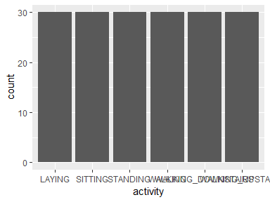
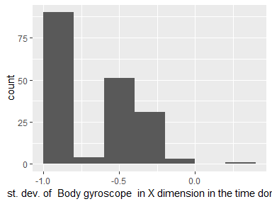
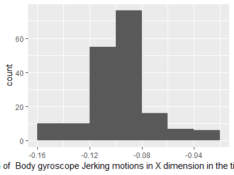
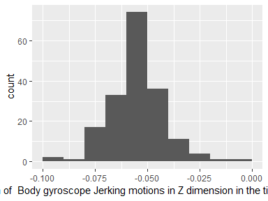
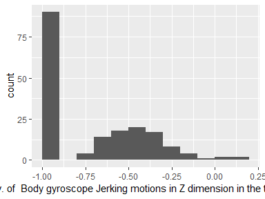
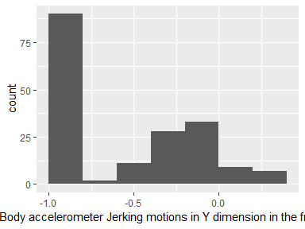
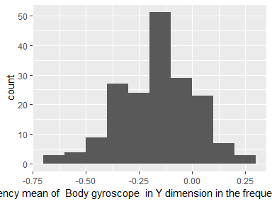

Introduction
============

To see how the data was generated and what transformations were
performed on the original dataset please refer to the ReadMe.

Data report overview
====================

The dataset examined has the following dimensions:

<table style="width:46%;">
<colgroup>
<col width="34%" />
<col width="11%" />
</colgroup>
<thead>
<tr class="header">
<th align="left">Feature</th>
<th align="right">Result</th>
</tr>
</thead>
<tbody>
<tr class="odd">
<td align="left">Number of observations</td>
<td align="right">180</td>
</tr>
<tr class="even">
<td align="left">Number of variables</td>
<td align="right">88</td>
</tr>
</tbody>
</table>

Codebook summary table
======================

<table>
<colgroup>
<col width="10%" />
<col width="28%" />
<col width="16%" />
<col width="14%" />
<col width="13%" />
<col width="17%" />
</colgroup>
<thead>
<tr class="header">
<th align="left">Label</th>
<th align="left">Variable</th>
<th align="left">Class</th>
<th align="right"># unique values</th>
<th align="center">Missing</th>
<th align="left">Description</th>
</tr>
</thead>
<tbody>
<tr class="odd">
<td align="left"></td>
<td align="left"><strong><a href="#subject">subject</a></strong></td>
<td align="left">integer</td>
<td align="right">30</td>
<td align="center">0.00 %</td>
<td align="left"></td>
</tr>
<tr class="even">
<td align="left"></td>
<td align="left"><strong><a href="#activity">activity</a></strong></td>
<td align="left">character</td>
<td align="right">6</td>
<td align="center">0.00 %</td>
<td align="left"></td>
</tr>
<tr class="odd">
<td align="left"></td>
<td align="left"><strong><a href="#mean-of-body-accelerometer-in-x-dimension-in-the-time-domain">mean of Body accelerometer in X dimension in the time domain</a></strong></td>
<td align="left">numeric</td>
<td align="right">180</td>
<td align="center">0.00 %</td>
<td align="left"></td>
</tr>
<tr class="even">
<td align="left"></td>
<td align="left"><strong><a href="#mean-of-body-accelerometer-in-y-dimension-in-the-time-domain">mean of Body accelerometer in Y dimension in the time domain</a></strong></td>
<td align="left">numeric</td>
<td align="right">180</td>
<td align="center">0.00 %</td>
<td align="left"></td>
</tr>
<tr class="odd">
<td align="left"></td>
<td align="left"><strong><a href="#mean-of-body-accelerometer-in-z-dimension-in-the-time-domain">mean of Body accelerometer in Z dimension in the time domain</a></strong></td>
<td align="left">numeric</td>
<td align="right">180</td>
<td align="center">0.00 %</td>
<td align="left"></td>
</tr>
<tr class="even">
<td align="left"></td>
<td align="left"><strong><a href="#st.-dev.-of-body-accelerometer-in-x-dimension-in-the-time-domain">st. dev. of Body accelerometer in X dimension in the time domain</a></strong></td>
<td align="left">numeric</td>
<td align="right">180</td>
<td align="center">0.00 %</td>
<td align="left"></td>
</tr>
<tr class="odd">
<td align="left"></td>
<td align="left"><strong><a href="#st.-dev.-of-body-accelerometer-in-y-dimension-in-the-time-domain">st. dev. of Body accelerometer in Y dimension in the time domain</a></strong></td>
<td align="left">numeric</td>
<td align="right">180</td>
<td align="center">0.00 %</td>
<td align="left"></td>
</tr>
<tr class="even">
<td align="left"></td>
<td align="left"><strong><a href="#st.-dev.-of-body-accelerometer-in-z-dimension-in-the-time-domain">st. dev. of Body accelerometer in Z dimension in the time domain</a></strong></td>
<td align="left">numeric</td>
<td align="right">180</td>
<td align="center">0.00 %</td>
<td align="left"></td>
</tr>
<tr class="odd">
<td align="left"></td>
<td align="left"><strong><a href="#mean-of-gravity-accelerometer-in-x-dimension-in-the-time-domain">mean of Gravity accelerometer in X dimension in the time domain</a></strong></td>
<td align="left">numeric</td>
<td align="right">180</td>
<td align="center">0.00 %</td>
<td align="left"></td>
</tr>
<tr class="even">
<td align="left"></td>
<td align="left"><strong><a href="#mean-of-gravity-accelerometer-in-y-dimension-in-the-time-domain">mean of Gravity accelerometer in Y dimension in the time domain</a></strong></td>
<td align="left">numeric</td>
<td align="right">180</td>
<td align="center">0.00 %</td>
<td align="left"></td>
</tr>
<tr class="odd">
<td align="left"></td>
<td align="left"><strong><a href="#mean-of-gravity-accelerometer-in-z-dimension-in-the-time-domain">mean of Gravity accelerometer in Z dimension in the time domain</a></strong></td>
<td align="left">numeric</td>
<td align="right">180</td>
<td align="center">0.00 %</td>
<td align="left"></td>
</tr>
<tr class="even">
<td align="left"></td>
<td align="left"><strong><a href="#st.-dev.-of-gravity-accelerometer-in-x-dimension-in-the-time-domain">st. dev. of Gravity accelerometer in X dimension in the time domain</a></strong></td>
<td align="left">numeric</td>
<td align="right">180</td>
<td align="center">0.00 %</td>
<td align="left"></td>
</tr>
<tr class="odd">
<td align="left"></td>
<td align="left"><strong><a href="#st.-dev.-of-gravity-accelerometer-in-y-dimension-in-the-time-domain">st. dev. of Gravity accelerometer in Y dimension in the time domain</a></strong></td>
<td align="left">numeric</td>
<td align="right">180</td>
<td align="center">0.00 %</td>
<td align="left"></td>
</tr>
<tr class="even">
<td align="left"></td>
<td align="left"><strong><a href="#st.-dev.-of-gravity-accelerometer-in-z-dimension-in-the-time-domain">st. dev. of Gravity accelerometer in Z dimension in the time domain</a></strong></td>
<td align="left">numeric</td>
<td align="right">180</td>
<td align="center">0.00 %</td>
<td align="left"></td>
</tr>
<tr class="odd">
<td align="left"></td>
<td align="left"><strong><a href="#mean-of-body-accelerometer-jerking-motions-in-x-dimension-in-the-time-domain">mean of Body accelerometer Jerking motions in X dimension in the time domain</a></strong></td>
<td align="left">numeric</td>
<td align="right">180</td>
<td align="center">0.00 %</td>
<td align="left"></td>
</tr>
<tr class="even">
<td align="left"></td>
<td align="left"><strong><a href="#mean-of-body-accelerometer-jerking-motions-in-y-dimension-in-the-time-domain">mean of Body accelerometer Jerking motions in Y dimension in the time domain</a></strong></td>
<td align="left">numeric</td>
<td align="right">180</td>
<td align="center">0.00 %</td>
<td align="left"></td>
</tr>
<tr class="odd">
<td align="left"></td>
<td align="left"><strong><a href="#mean-of-body-accelerometer-jerking-motions-in-z-dimension-in-the-time-domain">mean of Body accelerometer Jerking motions in Z dimension in the time domain</a></strong></td>
<td align="left">numeric</td>
<td align="right">180</td>
<td align="center">0.00 %</td>
<td align="left"></td>
</tr>
<tr class="even">
<td align="left"></td>
<td align="left"><strong><a href="#st.-dev.-of-body-accelerometer-jerking-motions-in-x-dimension-in-the-time-domain">st. dev. of Body accelerometer Jerking motions in X dimension in the time domain</a></strong></td>
<td align="left">numeric</td>
<td align="right">180</td>
<td align="center">0.00 %</td>
<td align="left"></td>
</tr>
<tr class="odd">
<td align="left"></td>
<td align="left"><strong><a href="#st.-dev.-of-body-accelerometer-jerking-motions-in-y-dimension-in-the-time-domain">st. dev. of Body accelerometer Jerking motions in Y dimension in the time domain</a></strong></td>
<td align="left">numeric</td>
<td align="right">180</td>
<td align="center">0.00 %</td>
<td align="left"></td>
</tr>
<tr class="even">
<td align="left"></td>
<td align="left"><strong><a href="#st.-dev.-of-body-accelerometer-jerking-motions-in-z-dimension-in-the-time-domain">st. dev. of Body accelerometer Jerking motions in Z dimension in the time domain</a></strong></td>
<td align="left">numeric</td>
<td align="right">180</td>
<td align="center">0.00 %</td>
<td align="left"></td>
</tr>
<tr class="odd">
<td align="left"></td>
<td align="left"><strong><a href="#mean-of-body-gyroscope-in-x-dimension-in-the-time-domain">mean of Body gyroscope in X dimension in the time domain</a></strong></td>
<td align="left">numeric</td>
<td align="right">180</td>
<td align="center">0.00 %</td>
<td align="left"></td>
</tr>
<tr class="even">
<td align="left"></td>
<td align="left"><strong><a href="#mean-of-body-gyroscope-in-y-dimension-in-the-time-domain">mean of Body gyroscope in Y dimension in the time domain</a></strong></td>
<td align="left">numeric</td>
<td align="right">180</td>
<td align="center">0.00 %</td>
<td align="left"></td>
</tr>
<tr class="odd">
<td align="left"></td>
<td align="left"><strong><a href="#mean-of-body-gyroscope-in-z-dimension-in-the-time-domain">mean of Body gyroscope in Z dimension in the time domain</a></strong></td>
<td align="left">numeric</td>
<td align="right">180</td>
<td align="center">0.00 %</td>
<td align="left"></td>
</tr>
<tr class="even">
<td align="left"></td>
<td align="left"><strong><a href="#st.-dev.-of-body-gyroscope-in-x-dimension-in-the-time-domain">st. dev. of Body gyroscope in X dimension in the time domain</a></strong></td>
<td align="left">numeric</td>
<td align="right">180</td>
<td align="center">0.00 %</td>
<td align="left"></td>
</tr>
<tr class="odd">
<td align="left"></td>
<td align="left"><strong><a href="#st.-dev.-of-body-gyroscope-in-y-dimension-in-the-time-domain">st. dev. of Body gyroscope in Y dimension in the time domain</a></strong></td>
<td align="left">numeric</td>
<td align="right">180</td>
<td align="center">0.00 %</td>
<td align="left"></td>
</tr>
<tr class="even">
<td align="left"></td>
<td align="left"><strong><a href="#st.-dev.-of-body-gyroscope-in-z-dimension-in-the-time-domain">st. dev. of Body gyroscope in Z dimension in the time domain</a></strong></td>
<td align="left">numeric</td>
<td align="right">180</td>
<td align="center">0.00 %</td>
<td align="left"></td>
</tr>
<tr class="odd">
<td align="left"></td>
<td align="left"><strong><a href="#mean-of-body-gyroscope-jerking-motions-in-x-dimension-in-the-time-domain">mean of Body gyroscope Jerking motions in X dimension in the time domain</a></strong></td>
<td align="left">numeric</td>
<td align="right">180</td>
<td align="center">0.00 %</td>
<td align="left"></td>
</tr>
<tr class="even">
<td align="left"></td>
<td align="left"><strong><a href="#mean-of-body-gyroscope-jerking-motions-in-y-dimension-in-the-time-domain">mean of Body gyroscope Jerking motions in Y dimension in the time domain</a></strong></td>
<td align="left">numeric</td>
<td align="right">180</td>
<td align="center">0.00 %</td>
<td align="left"></td>
</tr>
<tr class="odd">
<td align="left"></td>
<td align="left"><strong><a href="#mean-of-body-gyroscope-jerking-motions-in-z-dimension-in-the-time-domain">mean of Body gyroscope Jerking motions in Z dimension in the time domain</a></strong></td>
<td align="left">numeric</td>
<td align="right">180</td>
<td align="center">0.00 %</td>
<td align="left"></td>
</tr>
<tr class="even">
<td align="left"></td>
<td align="left"><strong><a href="#st.-dev.-of-body-gyroscope-jerking-motions-in-x-dimension-in-the-time-domain">st. dev. of Body gyroscope Jerking motions in X dimension in the time domain</a></strong></td>
<td align="left">numeric</td>
<td align="right">180</td>
<td align="center">0.00 %</td>
<td align="left"></td>
</tr>
<tr class="odd">
<td align="left"></td>
<td align="left"><strong><a href="#st.-dev.-of-body-gyroscope-jerking-motions-in-y-dimension-in-the-time-domain">st. dev. of Body gyroscope Jerking motions in Y dimension in the time domain</a></strong></td>
<td align="left">numeric</td>
<td align="right">180</td>
<td align="center">0.00 %</td>
<td align="left"></td>
</tr>
<tr class="even">
<td align="left"></td>
<td align="left"><strong><a href="#st.-dev.-of-body-gyroscope-jerking-motions-in-z-dimension-in-the-time-domain">st. dev. of Body gyroscope Jerking motions in Z dimension in the time domain</a></strong></td>
<td align="left">numeric</td>
<td align="right">180</td>
<td align="center">0.00 %</td>
<td align="left"></td>
</tr>
<tr class="odd">
<td align="left"></td>
<td align="left"><strong><a href="#mean-of-magnitude-of-body-accelerometer-in-z-dimension-in-the-time-domain">mean of magnitude of Body accelerometer in Z dimension in the time domain</a></strong></td>
<td align="left">numeric</td>
<td align="right">180</td>
<td align="center">0.00 %</td>
<td align="left"></td>
</tr>
<tr class="even">
<td align="left"></td>
<td align="left"><strong><a href="#st.-dev.-of-magnitude-of-body-accelerometer-in-z-dimension-in-the-time-domain">st. dev. of magnitude of Body accelerometer in Z dimension in the time domain</a></strong></td>
<td align="left">numeric</td>
<td align="right">180</td>
<td align="center">0.00 %</td>
<td align="left"></td>
</tr>
<tr class="odd">
<td align="left"></td>
<td align="left"><strong><a href="#mean-of-magnitude-of-gravity-accelerometer-in-z-dimension-in-the-time-domain">mean of magnitude of Gravity accelerometer in Z dimension in the time domain</a></strong></td>
<td align="left">numeric</td>
<td align="right">180</td>
<td align="center">0.00 %</td>
<td align="left"></td>
</tr>
<tr class="even">
<td align="left"></td>
<td align="left"><strong><a href="#st.-dev.-of-magnitude-of-gravity-accelerometer-in-z-dimension-in-the-time-domain">st. dev. of magnitude of Gravity accelerometer in Z dimension in the time domain</a></strong></td>
<td align="left">numeric</td>
<td align="right">180</td>
<td align="center">0.00 %</td>
<td align="left"></td>
</tr>
<tr class="odd">
<td align="left"></td>
<td align="left"><strong><a href="#mean-of-magnitude-of-body-accelerometer-jerking-motions-in-z-dimension-in-the-time-domain">mean of magnitude of Body accelerometer Jerking motions in Z dimension in the time domain</a></strong></td>
<td align="left">numeric</td>
<td align="right">180</td>
<td align="center">0.00 %</td>
<td align="left"></td>
</tr>
<tr class="even">
<td align="left"></td>
<td align="left"><strong><a href="#st.-dev.-of-magnitude-of-body-accelerometer-jerking-motions-in-z-dimension-in-the-time-domain">st. dev. of magnitude of Body accelerometer Jerking motions in Z dimension in the time domain</a></strong></td>
<td align="left">numeric</td>
<td align="right">180</td>
<td align="center">0.00 %</td>
<td align="left"></td>
</tr>
<tr class="odd">
<td align="left"></td>
<td align="left"><strong><a href="#mean-of-magnitude-of-body-gyroscope-in-z-dimension-in-the-time-domain">mean of magnitude of Body gyroscope in Z dimension in the time domain</a></strong></td>
<td align="left">numeric</td>
<td align="right">180</td>
<td align="center">0.00 %</td>
<td align="left"></td>
</tr>
<tr class="even">
<td align="left"></td>
<td align="left"><strong><a href="#st.-dev.-of-magnitude-of-body-gyroscope-in-z-dimension-in-the-time-domain">st. dev. of magnitude of Body gyroscope in Z dimension in the time domain</a></strong></td>
<td align="left">numeric</td>
<td align="right">180</td>
<td align="center">0.00 %</td>
<td align="left"></td>
</tr>
<tr class="odd">
<td align="left"></td>
<td align="left"><strong><a href="#mean-of-magnitude-of-body-gyroscope-jerking-motions-in-z-dimension-in-the-time-domain">mean of magnitude of Body gyroscope Jerking motions in Z dimension in the time domain</a></strong></td>
<td align="left">numeric</td>
<td align="right">180</td>
<td align="center">0.00 %</td>
<td align="left"></td>
</tr>
<tr class="even">
<td align="left"></td>
<td align="left"><strong><a href="#st.-dev.-of-magnitude-of-body-gyroscope-jerking-motions-in-z-dimension-in-the-time-domain">st. dev. of magnitude of Body gyroscope Jerking motions in Z dimension in the time domain</a></strong></td>
<td align="left">numeric</td>
<td align="right">180</td>
<td align="center">0.00 %</td>
<td align="left"></td>
</tr>
<tr class="odd">
<td align="left"></td>
<td align="left"><strong><a href="#mean-of-body-accelerometer-in-x-dimension-in-the-frequency-domain">mean of Body accelerometer in X dimension in the frequency domain</a></strong></td>
<td align="left">numeric</td>
<td align="right">180</td>
<td align="center">0.00 %</td>
<td align="left"></td>
</tr>
<tr class="even">
<td align="left"></td>
<td align="left"><strong><a href="#mean-of-body-accelerometer-in-y-dimension-in-the-frequency-domain">mean of Body accelerometer in Y dimension in the frequency domain</a></strong></td>
<td align="left">numeric</td>
<td align="right">180</td>
<td align="center">0.00 %</td>
<td align="left"></td>
</tr>
<tr class="odd">
<td align="left"></td>
<td align="left"><strong><a href="#mean-of-body-accelerometer-in-z-dimension-in-the-frequency-domain">mean of Body accelerometer in Z dimension in the frequency domain</a></strong></td>
<td align="left">numeric</td>
<td align="right">180</td>
<td align="center">0.00 %</td>
<td align="left"></td>
</tr>
<tr class="even">
<td align="left"></td>
<td align="left"><strong><a href="#st.-dev.-of-body-accelerometer-in-x-dimension-in-the-frequency-domain">st. dev. of Body accelerometer in X dimension in the frequency domain</a></strong></td>
<td align="left">numeric</td>
<td align="right">180</td>
<td align="center">0.00 %</td>
<td align="left"></td>
</tr>
<tr class="odd">
<td align="left"></td>
<td align="left"><strong><a href="#st.-dev.-of-body-accelerometer-in-y-dimension-in-the-frequency-domain">st. dev. of Body accelerometer in Y dimension in the frequency domain</a></strong></td>
<td align="left">numeric</td>
<td align="right">180</td>
<td align="center">0.00 %</td>
<td align="left"></td>
</tr>
<tr class="even">
<td align="left"></td>
<td align="left"><strong><a href="#st.-dev.-of-body-accelerometer-in-z-dimension-in-the-frequency-domain">st. dev. of Body accelerometer in Z dimension in the frequency domain</a></strong></td>
<td align="left">numeric</td>
<td align="right">180</td>
<td align="center">0.00 %</td>
<td align="left"></td>
</tr>
<tr class="odd">
<td align="left"></td>
<td align="left"><strong><a href="#frequency-mean-of-body-accelerometer-in-x-dimension-in-the-frequency-domain">frequency mean of Body accelerometer in X dimension in the frequency domain</a></strong></td>
<td align="left">numeric</td>
<td align="right">180</td>
<td align="center">0.00 %</td>
<td align="left"></td>
</tr>
<tr class="even">
<td align="left"></td>
<td align="left"><strong><a href="#frequency-mean-of-body-accelerometer-in-y-dimension-in-the-frequency-domain">frequency mean of Body accelerometer in Y dimension in the frequency domain</a></strong></td>
<td align="left">numeric</td>
<td align="right">180</td>
<td align="center">0.00 %</td>
<td align="left"></td>
</tr>
<tr class="odd">
<td align="left"></td>
<td align="left"><strong><a href="#frequency-mean-of-body-accelerometer-in-z-dimension-in-the-frequency-domain">frequency mean of Body accelerometer in Z dimension in the frequency domain</a></strong></td>
<td align="left">numeric</td>
<td align="right">180</td>
<td align="center">0.00 %</td>
<td align="left"></td>
</tr>
<tr class="even">
<td align="left"></td>
<td align="left"><strong><a href="#mean-of-body-accelerometer-jerking-motions-in-x-dimension-in-the-frequency-domain">mean of Body accelerometer Jerking motions in X dimension in the frequency domain</a></strong></td>
<td align="left">numeric</td>
<td align="right">180</td>
<td align="center">0.00 %</td>
<td align="left"></td>
</tr>
<tr class="odd">
<td align="left"></td>
<td align="left"><strong><a href="#mean-of-body-accelerometer-jerking-motions-in-y-dimension-in-the-frequency-domain">mean of Body accelerometer Jerking motions in Y dimension in the frequency domain</a></strong></td>
<td align="left">numeric</td>
<td align="right">180</td>
<td align="center">0.00 %</td>
<td align="left"></td>
</tr>
<tr class="even">
<td align="left"></td>
<td align="left"><strong><a href="#mean-of-body-accelerometer-jerking-motions-in-z-dimension-in-the-frequency-domain">mean of Body accelerometer Jerking motions in Z dimension in the frequency domain</a></strong></td>
<td align="left">numeric</td>
<td align="right">180</td>
<td align="center">0.00 %</td>
<td align="left"></td>
</tr>
<tr class="odd">
<td align="left"></td>
<td align="left"><strong><a href="#st.-dev.-of-body-accelerometer-jerking-motions-in-x-dimension-in-the-frequency-domain">st. dev. of Body accelerometer Jerking motions in X dimension in the frequency domain</a></strong></td>
<td align="left">numeric</td>
<td align="right">180</td>
<td align="center">0.00 %</td>
<td align="left"></td>
</tr>
<tr class="even">
<td align="left"></td>
<td align="left"><strong><a href="#st.-dev.-of-body-accelerometer-jerking-motions-in-y-dimension-in-the-frequency-domain">st. dev. of Body accelerometer Jerking motions in Y dimension in the frequency domain</a></strong></td>
<td align="left">numeric</td>
<td align="right">180</td>
<td align="center">0.00 %</td>
<td align="left"></td>
</tr>
<tr class="odd">
<td align="left"></td>
<td align="left"><strong><a href="#st.-dev.-of-body-accelerometer-jerking-motions-in-z-dimension-in-the-frequency-domain">st. dev. of Body accelerometer Jerking motions in Z dimension in the frequency domain</a></strong></td>
<td align="left">numeric</td>
<td align="right">180</td>
<td align="center">0.00 %</td>
<td align="left"></td>
</tr>
<tr class="even">
<td align="left"></td>
<td align="left"><strong><a href="#frequency-mean-of-body-accelerometer-jerking-motions-in-x-dimension-in-the-frequency-domain">frequency mean of Body accelerometer Jerking motions in X dimension in the frequency domain</a></strong></td>
<td align="left">numeric</td>
<td align="right">180</td>
<td align="center">0.00 %</td>
<td align="left"></td>
</tr>
<tr class="odd">
<td align="left"></td>
<td align="left"><strong><a href="#frequency-mean-of-body-accelerometer-jerking-motions-in-y-dimension-in-the-frequency-domain">frequency mean of Body accelerometer Jerking motions in Y dimension in the frequency domain</a></strong></td>
<td align="left">numeric</td>
<td align="right">180</td>
<td align="center">0.00 %</td>
<td align="left"></td>
</tr>
<tr class="even">
<td align="left"></td>
<td align="left"><strong><a href="#frequency-mean-of-body-accelerometer-jerking-motions-in-z-dimension-in-the-frequency-domain">frequency mean of Body accelerometer Jerking motions in Z dimension in the frequency domain</a></strong></td>
<td align="left">numeric</td>
<td align="right">180</td>
<td align="center">0.00 %</td>
<td align="left"></td>
</tr>
<tr class="odd">
<td align="left"></td>
<td align="left"><strong><a href="#mean-of-body-gyroscope-in-x-dimension-in-the-frequency-domain">mean of Body gyroscope in X dimension in the frequency domain</a></strong></td>
<td align="left">numeric</td>
<td align="right">180</td>
<td align="center">0.00 %</td>
<td align="left"></td>
</tr>
<tr class="even">
<td align="left"></td>
<td align="left"><strong><a href="#mean-of-body-gyroscope-in-y-dimension-in-the-frequency-domain">mean of Body gyroscope in Y dimension in the frequency domain</a></strong></td>
<td align="left">numeric</td>
<td align="right">180</td>
<td align="center">0.00 %</td>
<td align="left"></td>
</tr>
<tr class="odd">
<td align="left"></td>
<td align="left"><strong><a href="#mean-of-body-gyroscope-in-z-dimension-in-the-frequency-domain">mean of Body gyroscope in Z dimension in the frequency domain</a></strong></td>
<td align="left">numeric</td>
<td align="right">180</td>
<td align="center">0.00 %</td>
<td align="left"></td>
</tr>
<tr class="even">
<td align="left"></td>
<td align="left"><strong><a href="#st.-dev.-of-body-gyroscope-in-x-dimension-in-the-frequency-domain">st. dev. of Body gyroscope in X dimension in the frequency domain</a></strong></td>
<td align="left">numeric</td>
<td align="right">180</td>
<td align="center">0.00 %</td>
<td align="left"></td>
</tr>
<tr class="odd">
<td align="left"></td>
<td align="left"><strong><a href="#st.-dev.-of-body-gyroscope-in-y-dimension-in-the-frequency-domain">st. dev. of Body gyroscope in Y dimension in the frequency domain</a></strong></td>
<td align="left">numeric</td>
<td align="right">180</td>
<td align="center">0.00 %</td>
<td align="left"></td>
</tr>
<tr class="even">
<td align="left"></td>
<td align="left"><strong><a href="#st.-dev.-of-body-gyroscope-in-z-dimension-in-the-frequency-domain">st. dev. of Body gyroscope in Z dimension in the frequency domain</a></strong></td>
<td align="left">numeric</td>
<td align="right">180</td>
<td align="center">0.00 %</td>
<td align="left"></td>
</tr>
<tr class="odd">
<td align="left"></td>
<td align="left"><strong><a href="#frequency-mean-of-body-gyroscope-in-x-dimension-in-the-frequency-domain">frequency mean of Body gyroscope in X dimension in the frequency domain</a></strong></td>
<td align="left">numeric</td>
<td align="right">180</td>
<td align="center">0.00 %</td>
<td align="left"></td>
</tr>
<tr class="even">
<td align="left"></td>
<td align="left"><strong><a href="#frequency-mean-of-body-gyroscope-in-y-dimension-in-the-frequency-domain">frequency mean of Body gyroscope in Y dimension in the frequency domain</a></strong></td>
<td align="left">numeric</td>
<td align="right">180</td>
<td align="center">0.00 %</td>
<td align="left"></td>
</tr>
<tr class="odd">
<td align="left"></td>
<td align="left"><strong><a href="#frequency-mean-of-body-gyroscope-in-z-dimension-in-the-frequency-domain">frequency mean of Body gyroscope in Z dimension in the frequency domain</a></strong></td>
<td align="left">numeric</td>
<td align="right">180</td>
<td align="center">0.00 %</td>
<td align="left"></td>
</tr>
<tr class="even">
<td align="left"></td>
<td align="left"><strong><a href="#mean-of-magnitude-of-body-accelerometer-in-z-dimension-in-the-frequency-domain">mean of magnitude of Body accelerometer in Z dimension in the frequency domain</a></strong></td>
<td align="left">numeric</td>
<td align="right">180</td>
<td align="center">0.00 %</td>
<td align="left"></td>
</tr>
<tr class="odd">
<td align="left"></td>
<td align="left"><strong><a href="#st.-dev.-of-magnitude-of-body-accelerometer-in-z-dimension-in-the-frequency-domain">st. dev. of magnitude of Body accelerometer in Z dimension in the frequency domain</a></strong></td>
<td align="left">numeric</td>
<td align="right">180</td>
<td align="center">0.00 %</td>
<td align="left"></td>
</tr>
<tr class="even">
<td align="left"></td>
<td align="left"><strong><a href="#frequency-mean-of-magnitude-of-body-accelerometer-in-z-dimension-in-the-frequency-domain">frequency mean of magnitude of Body accelerometer in Z dimension in the frequency domain</a></strong></td>
<td align="left">numeric</td>
<td align="right">180</td>
<td align="center">0.00 %</td>
<td align="left"></td>
</tr>
<tr class="odd">
<td align="left"></td>
<td align="left"><strong><a href="#mean-of-magnitude-of-body-accelerometer-jerking-motions-in-z-dimension-in-the-frequency-domain">mean of magnitude of Body accelerometer Jerking motions in Z dimension in the frequency domain</a></strong></td>
<td align="left">numeric</td>
<td align="right">180</td>
<td align="center">0.00 %</td>
<td align="left"></td>
</tr>
<tr class="even">
<td align="left"></td>
<td align="left"><strong><a href="#st.-dev.-of-magnitude-of-body-accelerometer-jerking-motions-in-z-dimension-in-the-frequency-domain">st. dev. of magnitude of Body accelerometer Jerking motions in Z dimension in the frequency domain</a></strong></td>
<td align="left">numeric</td>
<td align="right">180</td>
<td align="center">0.00 %</td>
<td align="left"></td>
</tr>
<tr class="odd">
<td align="left"></td>
<td align="left"><strong><a href="#frequency-mean-of-magnitude-of-body-accelerometer-jerking-motions-in-z-dimension-in-the-frequency-domain">frequency mean of magnitude of Body accelerometer Jerking motions in Z dimension in the frequency domain</a></strong></td>
<td align="left">numeric</td>
<td align="right">180</td>
<td align="center">0.00 %</td>
<td align="left"></td>
</tr>
<tr class="even">
<td align="left"></td>
<td align="left"><strong><a href="#mean-of-magnitude-of-body-gyroscope-in-z-dimension-in-the-frequency-domain">mean of magnitude of Body gyroscope in Z dimension in the frequency domain</a></strong></td>
<td align="left">numeric</td>
<td align="right">180</td>
<td align="center">0.00 %</td>
<td align="left"></td>
</tr>
<tr class="odd">
<td align="left"></td>
<td align="left"><strong><a href="#st.-dev.-of-magnitude-of-body-gyroscope-in-z-dimension-in-the-frequency-domain">st. dev. of magnitude of Body gyroscope in Z dimension in the frequency domain</a></strong></td>
<td align="left">numeric</td>
<td align="right">180</td>
<td align="center">0.00 %</td>
<td align="left"></td>
</tr>
<tr class="even">
<td align="left"></td>
<td align="left"><strong><a href="#frequency-mean-of-magnitude-of-body-gyroscope-in-z-dimension-in-the-frequency-domain">frequency mean of magnitude of Body gyroscope in Z dimension in the frequency domain</a></strong></td>
<td align="left">numeric</td>
<td align="right">180</td>
<td align="center">0.00 %</td>
<td align="left"></td>
</tr>
<tr class="odd">
<td align="left"></td>
<td align="left"><strong><a href="#mean-of-magnitude-of-body-gyroscope-jerking-motions-in-z-dimension-in-the-frequency-domain">mean of magnitude of Body gyroscope Jerking motions in Z dimension in the frequency domain</a></strong></td>
<td align="left">numeric</td>
<td align="right">180</td>
<td align="center">0.00 %</td>
<td align="left"></td>
</tr>
<tr class="even">
<td align="left"></td>
<td align="left"><strong><a href="#st.-dev.-of-magnitude-of-body-gyroscope-jerking-motions-in-z-dimension-in-the-frequency-domain">st. dev. of magnitude of Body gyroscope Jerking motions in Z dimension in the frequency domain</a></strong></td>
<td align="left">numeric</td>
<td align="right">180</td>
<td align="center">0.00 %</td>
<td align="left"></td>
</tr>
<tr class="odd">
<td align="left"></td>
<td align="left"><strong><a href="#frequency-mean-of-magnitude-of-body-gyroscope-jerking-motions-in-z-dimension-in-the-frequency-domain">frequency mean of magnitude of Body gyroscope Jerking motions in Z dimension in the frequency domain</a></strong></td>
<td align="left">numeric</td>
<td align="right">180</td>
<td align="center">0.00 %</td>
<td align="left"></td>
</tr>
<tr class="even">
<td align="left"></td>
<td align="left"><strong><a href="#angletime-domain-body-acceleration-meangravity">angle(time domain Body acceleration Mean,gravity )</a></strong></td>
<td align="left">numeric</td>
<td align="right">180</td>
<td align="center">0.00 %</td>
<td align="left"></td>
</tr>
<tr class="odd">
<td align="left"></td>
<td align="left"><strong><a href="#angletime-domain-body-acceleration-jerk-meangravity-mean">angle(time domain Body acceleration Jerk Mean),gravity Mean)</a></strong></td>
<td align="left">numeric</td>
<td align="right">180</td>
<td align="center">0.00 %</td>
<td align="left"></td>
</tr>
<tr class="even">
<td align="left"></td>
<td align="left"><strong><a href="#angletime-domain-body-gyroscope-meangravity-mean">angle(time domain Body gyroscope Mean,gravity Mean)</a></strong></td>
<td align="left">numeric</td>
<td align="right">180</td>
<td align="center">0.00 %</td>
<td align="left"></td>
</tr>
<tr class="odd">
<td align="left"></td>
<td align="left"><strong><a href="#angletime-domain-body-gyroscope-jerk-meangravity-mean">angle(time domain Body gyroscope Jerk Mean,gravity Mean)</a></strong></td>
<td align="left">numeric</td>
<td align="right">180</td>
<td align="center">0.00 %</td>
<td align="left"></td>
</tr>
<tr class="even">
<td align="left"></td>
<td align="left"><strong><a href="#anglexgravity-mean">angle(X,gravity Mean)</a></strong></td>
<td align="left">numeric</td>
<td align="right">180</td>
<td align="center">0.00 %</td>
<td align="left"></td>
</tr>
<tr class="odd">
<td align="left"></td>
<td align="left"><strong><a href="#angleygravity-mean">angle(Y,gravity Mean)</a></strong></td>
<td align="left">numeric</td>
<td align="right">180</td>
<td align="center">0.00 %</td>
<td align="left"></td>
</tr>
<tr class="even">
<td align="left"></td>
<td align="left"><strong><a href="#anglezgravity-mean">angle(Z,gravity Mean)</a></strong></td>
<td align="left">numeric</td>
<td align="right">180</td>
<td align="center">0.00 %</td>
<td align="left"></td>
</tr>
</tbody>
</table>

Variable list
=============

subject
-------

<table style="width:49%;">
<colgroup>
<col width="36%" />
<col width="12%" />
</colgroup>
<thead>
<tr class="header">
<th align="left">Feature</th>
<th align="right">Result</th>
</tr>
</thead>
<tbody>
<tr class="odd">
<td align="left">Variable type</td>
<td align="right">integer</td>
</tr>
<tr class="even">
<td align="left">Number of missing obs.</td>
<td align="right">0 (0 %)</td>
</tr>
<tr class="odd">
<td align="left">Number of unique values</td>
<td align="right">30</td>
</tr>
<tr class="even">
<td align="left">Median</td>
<td align="right">15.5</td>
</tr>
<tr class="odd">
<td align="left">1st and 3rd quartiles</td>
<td align="right">8; 23</td>
</tr>
<tr class="even">
<td align="left">Min. and max.</td>
<td align="right">1; 30</td>
</tr>
</tbody>
</table>

------------------------------------------------------------------------

activity
--------

<table style="width:51%;">
<colgroup>
<col width="36%" />
<col width="15%" />
</colgroup>
<thead>
<tr class="header">
<th align="left">Feature</th>
<th align="right">Result</th>
</tr>
</thead>
<tbody>
<tr class="odd">
<td align="left">Variable type</td>
<td align="right">character</td>
</tr>
<tr class="even">
<td align="left">Number of missing obs.</td>
<td align="right">0 (0 %)</td>
</tr>
<tr class="odd">
<td align="left">Number of unique values</td>
<td align="right">6</td>
</tr>
<tr class="even">
<td align="left">Mode</td>
<td align="right">&quot;LAYING&quot;</td>
</tr>
</tbody>
</table>

-   Observed factor levels: "LAYING", "SITTING", "STANDING", "WALKING",
    "WALKING\_DOWNSTAIRS", "WALKING\_UPSTAIRS".

------------------------------------------------------------------------

mean of Body accelerometer in X dimension in the time domain
------------------------------------------------------------

<table style="width:53%;">
<colgroup>
<col width="36%" />
<col width="16%" />
</colgroup>
<thead>
<tr class="header">
<th align="left">Feature</th>
<th align="right">Result</th>
</tr>
</thead>
<tbody>
<tr class="odd">
<td align="left">Variable type</td>
<td align="right">numeric</td>
</tr>
<tr class="even">
<td align="left">Number of missing obs.</td>
<td align="right">0 (0 %)</td>
</tr>
<tr class="odd">
<td align="left">Number of unique values</td>
<td align="right">180</td>
</tr>
<tr class="even">
<td align="left">Median</td>
<td align="right">0.28</td>
</tr>
<tr class="odd">
<td align="left">1st and 3rd quartiles</td>
<td align="right">0.27; 0.28</td>
</tr>
<tr class="even">
<td align="left">Min. and max.</td>
<td align="right">0.22; 0.3</td>
</tr>
</tbody>
</table>

------------------------------------------------------------------------

mean of Body accelerometer in Y dimension in the time domain
------------------------------------------------------------

<table style="width:56%;">
<colgroup>
<col width="36%" />
<col width="19%" />
</colgroup>
<thead>
<tr class="header">
<th align="left">Feature</th>
<th align="right">Result</th>
</tr>
</thead>
<tbody>
<tr class="odd">
<td align="left">Variable type</td>
<td align="right">numeric</td>
</tr>
<tr class="even">
<td align="left">Number of missing obs.</td>
<td align="right">0 (0 %)</td>
</tr>
<tr class="odd">
<td align="left">Number of unique values</td>
<td align="right">180</td>
</tr>
<tr class="even">
<td align="left">Median</td>
<td align="right">-0.02</td>
</tr>
<tr class="odd">
<td align="left">1st and 3rd quartiles</td>
<td align="right">-0.02; -0.01</td>
</tr>
<tr class="even">
<td align="left">Min. and max.</td>
<td align="right">-0.04; 0</td>
</tr>
</tbody>
</table>

------------------------------------------------------------------------

mean of Body accelerometer in Z dimension in the time domain
------------------------------------------------------------

<table style="width:56%;">
<colgroup>
<col width="36%" />
<col width="19%" />
</colgroup>
<thead>
<tr class="header">
<th align="left">Feature</th>
<th align="right">Result</th>
</tr>
</thead>
<tbody>
<tr class="odd">
<td align="left">Variable type</td>
<td align="right">numeric</td>
</tr>
<tr class="even">
<td align="left">Number of missing obs.</td>
<td align="right">0 (0 %)</td>
</tr>
<tr class="odd">
<td align="left">Number of unique values</td>
<td align="right">180</td>
</tr>
<tr class="even">
<td align="left">Median</td>
<td align="right">-0.11</td>
</tr>
<tr class="odd">
<td align="left">1st and 3rd quartiles</td>
<td align="right">-0.11; -0.1</td>
</tr>
<tr class="even">
<td align="left">Min. and max.</td>
<td align="right">-0.15; -0.08</td>
</tr>
</tbody>
</table>

------------------------------------------------------------------------

st. dev. of Body accelerometer in X dimension in the time domain
----------------------------------------------------------------

<table style="width:54%;">
<colgroup>
<col width="36%" />
<col width="18%" />
</colgroup>
<thead>
<tr class="header">
<th align="left">Feature</th>
<th align="right">Result</th>
</tr>
</thead>
<tbody>
<tr class="odd">
<td align="left">Variable type</td>
<td align="right">numeric</td>
</tr>
<tr class="even">
<td align="left">Number of missing obs.</td>
<td align="right">0 (0 %)</td>
</tr>
<tr class="odd">
<td align="left">Number of unique values</td>
<td align="right">180</td>
</tr>
<tr class="even">
<td align="left">Median</td>
<td align="right">-0.75</td>
</tr>
<tr class="odd">
<td align="left">1st and 3rd quartiles</td>
<td align="right">-0.98; -0.2</td>
</tr>
<tr class="even">
<td align="left">Min. and max.</td>
<td align="right">-1; 0.63</td>
</tr>
</tbody>
</table>

------------------------------------------------------------------------

st. dev. of Body accelerometer in Y dimension in the time domain
----------------------------------------------------------------

<table style="width:56%;">
<colgroup>
<col width="36%" />
<col width="19%" />
</colgroup>
<thead>
<tr class="header">
<th align="left">Feature</th>
<th align="right">Result</th>
</tr>
</thead>
<tbody>
<tr class="odd">
<td align="left">Variable type</td>
<td align="right">numeric</td>
</tr>
<tr class="even">
<td align="left">Number of missing obs.</td>
<td align="right">0 (0 %)</td>
</tr>
<tr class="odd">
<td align="left">Number of unique values</td>
<td align="right">180</td>
</tr>
<tr class="even">
<td align="left">Median</td>
<td align="right">-0.51</td>
</tr>
<tr class="odd">
<td align="left">1st and 3rd quartiles</td>
<td align="right">-0.94; -0.03</td>
</tr>
<tr class="even">
<td align="left">Min. and max.</td>
<td align="right">-0.99; 0.62</td>
</tr>
</tbody>
</table>

------------------------------------------------------------------------

st. dev. of Body accelerometer in Z dimension in the time domain
----------------------------------------------------------------

<table style="width:56%;">
<colgroup>
<col width="36%" />
<col width="19%" />
</colgroup>
<thead>
<tr class="header">
<th align="left">Feature</th>
<th align="right">Result</th>
</tr>
</thead>
<tbody>
<tr class="odd">
<td align="left">Variable type</td>
<td align="right">numeric</td>
</tr>
<tr class="even">
<td align="left">Number of missing obs.</td>
<td align="right">0 (0 %)</td>
</tr>
<tr class="odd">
<td align="left">Number of unique values</td>
<td align="right">180</td>
</tr>
<tr class="even">
<td align="left">Median</td>
<td align="right">-0.65</td>
</tr>
<tr class="odd">
<td align="left">1st and 3rd quartiles</td>
<td align="right">-0.95; -0.23</td>
</tr>
<tr class="even">
<td align="left">Min. and max.</td>
<td align="right">-0.99; 0.61</td>
</tr>
</tbody>
</table>

------------------------------------------------------------------------

mean of Gravity accelerometer in X dimension in the time domain
---------------------------------------------------------------

<table style="width:54%;">
<colgroup>
<col width="36%" />
<col width="18%" />
</colgroup>
<thead>
<tr class="header">
<th align="left">Feature</th>
<th align="right">Result</th>
</tr>
</thead>
<tbody>
<tr class="odd">
<td align="left">Variable type</td>
<td align="right">numeric</td>
</tr>
<tr class="even">
<td align="left">Number of missing obs.</td>
<td align="right">0 (0 %)</td>
</tr>
<tr class="odd">
<td align="left">Number of unique values</td>
<td align="right">180</td>
</tr>
<tr class="even">
<td align="left">Median</td>
<td align="right">0.92</td>
</tr>
<tr class="odd">
<td align="left">1st and 3rd quartiles</td>
<td align="right">0.84; 0.94</td>
</tr>
<tr class="even">
<td align="left">Min. and max.</td>
<td align="right">-0.68; 0.97</td>
</tr>
</tbody>
</table>

------------------------------------------------------------------------

mean of Gravity accelerometer in Y dimension in the time domain
---------------------------------------------------------------

<table style="width:54%;">
<colgroup>
<col width="36%" />
<col width="18%" />
</colgroup>
<thead>
<tr class="header">
<th align="left">Feature</th>
<th align="right">Result</th>
</tr>
</thead>
<tbody>
<tr class="odd">
<td align="left">Variable type</td>
<td align="right">numeric</td>
</tr>
<tr class="even">
<td align="left">Number of missing obs.</td>
<td align="right">0 (0 %)</td>
</tr>
<tr class="odd">
<td align="left">Number of unique values</td>
<td align="right">180</td>
</tr>
<tr class="even">
<td align="left">Median</td>
<td align="right">-0.13</td>
</tr>
<tr class="odd">
<td align="left">1st and 3rd quartiles</td>
<td align="right">-0.23; 0.09</td>
</tr>
<tr class="even">
<td align="left">Min. and max.</td>
<td align="right">-0.48; 0.96</td>
</tr>
</tbody>
</table>

------------------------------------------------------------------------

mean of Gravity accelerometer in Z dimension in the time domain
---------------------------------------------------------------

<table style="width:54%;">
<colgroup>
<col width="36%" />
<col width="18%" />
</colgroup>
<thead>
<tr class="header">
<th align="left">Feature</th>
<th align="right">Result</th>
</tr>
</thead>
<tbody>
<tr class="odd">
<td align="left">Variable type</td>
<td align="right">numeric</td>
</tr>
<tr class="even">
<td align="left">Number of missing obs.</td>
<td align="right">0 (0 %)</td>
</tr>
<tr class="odd">
<td align="left">Number of unique values</td>
<td align="right">180</td>
</tr>
<tr class="even">
<td align="left">Median</td>
<td align="right">0.02</td>
</tr>
<tr class="odd">
<td align="left">1st and 3rd quartiles</td>
<td align="right">-0.12; 0.15</td>
</tr>
<tr class="even">
<td align="left">Min. and max.</td>
<td align="right">-0.5; 0.96</td>
</tr>
</tbody>
</table>

------------------------------------------------------------------------

st. dev. of Gravity accelerometer in X dimension in the time domain
-------------------------------------------------------------------

<table style="width:56%;">
<colgroup>
<col width="36%" />
<col width="19%" />
</colgroup>
<thead>
<tr class="header">
<th align="left">Feature</th>
<th align="right">Result</th>
</tr>
</thead>
<tbody>
<tr class="odd">
<td align="left">Variable type</td>
<td align="right">numeric</td>
</tr>
<tr class="even">
<td align="left">Number of missing obs.</td>
<td align="right">0 (0 %)</td>
</tr>
<tr class="odd">
<td align="left">Number of unique values</td>
<td align="right">180</td>
</tr>
<tr class="even">
<td align="left">Median</td>
<td align="right">-0.97</td>
</tr>
<tr class="odd">
<td align="left">1st and 3rd quartiles</td>
<td align="right">-0.98; -0.95</td>
</tr>
<tr class="even">
<td align="left">Min. and max.</td>
<td align="right">-1; -0.83</td>
</tr>
</tbody>
</table>

------------------------------------------------------------------------

st. dev. of Gravity accelerometer in Y dimension in the time domain
-------------------------------------------------------------------

<table style="width:56%;">
<colgroup>
<col width="36%" />
<col width="19%" />
</colgroup>
<thead>
<tr class="header">
<th align="left">Feature</th>
<th align="right">Result</th>
</tr>
</thead>
<tbody>
<tr class="odd">
<td align="left">Variable type</td>
<td align="right">numeric</td>
</tr>
<tr class="even">
<td align="left">Number of missing obs.</td>
<td align="right">0 (0 %)</td>
</tr>
<tr class="odd">
<td align="left">Number of unique values</td>
<td align="right">180</td>
</tr>
<tr class="even">
<td align="left">Median</td>
<td align="right">-0.96</td>
</tr>
<tr class="odd">
<td align="left">1st and 3rd quartiles</td>
<td align="right">-0.97; -0.94</td>
</tr>
<tr class="even">
<td align="left">Min. and max.</td>
<td align="right">-0.99; -0.64</td>
</tr>
</tbody>
</table>

------------------------------------------------------------------------

st. dev. of Gravity accelerometer in Z dimension in the time domain
-------------------------------------------------------------------

<table style="width:56%;">
<colgroup>
<col width="36%" />
<col width="19%" />
</colgroup>
<thead>
<tr class="header">
<th align="left">Feature</th>
<th align="right">Result</th>
</tr>
</thead>
<tbody>
<tr class="odd">
<td align="left">Variable type</td>
<td align="right">numeric</td>
</tr>
<tr class="even">
<td align="left">Number of missing obs.</td>
<td align="right">0 (0 %)</td>
</tr>
<tr class="odd">
<td align="left">Number of unique values</td>
<td align="right">180</td>
</tr>
<tr class="even">
<td align="left">Median</td>
<td align="right">-0.95</td>
</tr>
<tr class="odd">
<td align="left">1st and 3rd quartiles</td>
<td align="right">-0.96; -0.92</td>
</tr>
<tr class="even">
<td align="left">Min. and max.</td>
<td align="right">-0.99; -0.61</td>
</tr>
</tbody>
</table>

------------------------------------------------------------------------

mean of Body accelerometer Jerking motions in X dimension in the time domain
----------------------------------------------------------------------------

<table style="width:53%;">
<colgroup>
<col width="36%" />
<col width="16%" />
</colgroup>
<thead>
<tr class="header">
<th align="left">Feature</th>
<th align="right">Result</th>
</tr>
</thead>
<tbody>
<tr class="odd">
<td align="left">Variable type</td>
<td align="right">numeric</td>
</tr>
<tr class="even">
<td align="left">Number of missing obs.</td>
<td align="right">0 (0 %)</td>
</tr>
<tr class="odd">
<td align="left">Number of unique values</td>
<td align="right">180</td>
</tr>
<tr class="even">
<td align="left">Median</td>
<td align="right">0.08</td>
</tr>
<tr class="odd">
<td align="left">1st and 3rd quartiles</td>
<td align="right">0.07; 0.08</td>
</tr>
<tr class="even">
<td align="left">Min. and max.</td>
<td align="right">0.04; 0.13</td>
</tr>
</tbody>
</table>

------------------------------------------------------------------------

mean of Body accelerometer Jerking motions in Y dimension in the time domain
----------------------------------------------------------------------------

<table style="width:54%;">
<colgroup>
<col width="36%" />
<col width="18%" />
</colgroup>
<thead>
<tr class="header">
<th align="left">Feature</th>
<th align="right">Result</th>
</tr>
</thead>
<tbody>
<tr class="odd">
<td align="left">Variable type</td>
<td align="right">numeric</td>
</tr>
<tr class="even">
<td align="left">Number of missing obs.</td>
<td align="right">0 (0 %)</td>
</tr>
<tr class="odd">
<td align="left">Number of unique values</td>
<td align="right">180</td>
</tr>
<tr class="even">
<td align="left">Median</td>
<td align="right">0.01</td>
</tr>
<tr class="odd">
<td align="left">1st and 3rd quartiles</td>
<td align="right">0; 0.01</td>
</tr>
<tr class="even">
<td align="left">Min. and max.</td>
<td align="right">-0.04; 0.06</td>
</tr>
</tbody>
</table>

------------------------------------------------------------------------

mean of Body accelerometer Jerking motions in Z dimension in the time domain
----------------------------------------------------------------------------

<table style="width:54%;">
<colgroup>
<col width="36%" />
<col width="18%" />
</colgroup>
<thead>
<tr class="header">
<th align="left">Feature</th>
<th align="right">Result</th>
</tr>
</thead>
<tbody>
<tr class="odd">
<td align="left">Variable type</td>
<td align="right">numeric</td>
</tr>
<tr class="even">
<td align="left">Number of missing obs.</td>
<td align="right">0 (0 %)</td>
</tr>
<tr class="odd">
<td align="left">Number of unique values</td>
<td align="right">180</td>
</tr>
<tr class="even">
<td align="left">Median</td>
<td align="right">0</td>
</tr>
<tr class="odd">
<td align="left">1st and 3rd quartiles</td>
<td align="right">-0.01; 0</td>
</tr>
<tr class="even">
<td align="left">Min. and max.</td>
<td align="right">-0.07; 0.04</td>
</tr>
</tbody>
</table>

------------------------------------------------------------------------

st. dev. of Body accelerometer Jerking motions in X dimension in the time domain
--------------------------------------------------------------------------------

<table style="width:56%;">
<colgroup>
<col width="36%" />
<col width="19%" />
</colgroup>
<thead>
<tr class="header">
<th align="left">Feature</th>
<th align="right">Result</th>
</tr>
</thead>
<tbody>
<tr class="odd">
<td align="left">Variable type</td>
<td align="right">numeric</td>
</tr>
<tr class="even">
<td align="left">Number of missing obs.</td>
<td align="right">0 (0 %)</td>
</tr>
<tr class="odd">
<td align="left">Number of unique values</td>
<td align="right">180</td>
</tr>
<tr class="even">
<td align="left">Median</td>
<td align="right">-0.81</td>
</tr>
<tr class="odd">
<td align="left">1st and 3rd quartiles</td>
<td align="right">-0.98; -0.22</td>
</tr>
<tr class="even">
<td align="left">Min. and max.</td>
<td align="right">-0.99; 0.54</td>
</tr>
</tbody>
</table>

------------------------------------------------------------------------

st. dev. of Body accelerometer Jerking motions in Y dimension in the time domain
--------------------------------------------------------------------------------

<table style="width:56%;">
<colgroup>
<col width="36%" />
<col width="19%" />
</colgroup>
<thead>
<tr class="header">
<th align="left">Feature</th>
<th align="right">Result</th>
</tr>
</thead>
<tbody>
<tr class="odd">
<td align="left">Variable type</td>
<td align="right">numeric</td>
</tr>
<tr class="even">
<td align="left">Number of missing obs.</td>
<td align="right">0 (0 %)</td>
</tr>
<tr class="odd">
<td align="left">Number of unique values</td>
<td align="right">180</td>
</tr>
<tr class="even">
<td align="left">Median</td>
<td align="right">-0.78</td>
</tr>
<tr class="odd">
<td align="left">1st and 3rd quartiles</td>
<td align="right">-0.97; -0.15</td>
</tr>
<tr class="even">
<td align="left">Min. and max.</td>
<td align="right">-0.99; 0.36</td>
</tr>
</tbody>
</table>

------------------------------------------------------------------------

st. dev. of Body accelerometer Jerking motions in Z dimension in the time domain
--------------------------------------------------------------------------------

<table style="width:56%;">
<colgroup>
<col width="36%" />
<col width="19%" />
</colgroup>
<thead>
<tr class="header">
<th align="left">Feature</th>
<th align="right">Result</th>
</tr>
</thead>
<tbody>
<tr class="odd">
<td align="left">Variable type</td>
<td align="right">numeric</td>
</tr>
<tr class="even">
<td align="left">Number of missing obs.</td>
<td align="right">0 (0 %)</td>
</tr>
<tr class="odd">
<td align="left">Number of unique values</td>
<td align="right">180</td>
</tr>
<tr class="even">
<td align="left">Median</td>
<td align="right">-0.88</td>
</tr>
<tr class="odd">
<td align="left">1st and 3rd quartiles</td>
<td align="right">-0.98; -0.51</td>
</tr>
<tr class="even">
<td align="left">Min. and max.</td>
<td align="right">-0.99; 0.03</td>
</tr>
</tbody>
</table>

------------------------------------------------------------------------

mean of Body gyroscope in X dimension in the time domain
--------------------------------------------------------

<table style="width:56%;">
<colgroup>
<col width="36%" />
<col width="19%" />
</colgroup>
<thead>
<tr class="header">
<th align="left">Feature</th>
<th align="right">Result</th>
</tr>
</thead>
<tbody>
<tr class="odd">
<td align="left">Variable type</td>
<td align="right">numeric</td>
</tr>
<tr class="even">
<td align="left">Number of missing obs.</td>
<td align="right">0 (0 %)</td>
</tr>
<tr class="odd">
<td align="left">Number of unique values</td>
<td align="right">180</td>
</tr>
<tr class="even">
<td align="left">Median</td>
<td align="right">-0.03</td>
</tr>
<tr class="odd">
<td align="left">1st and 3rd quartiles</td>
<td align="right">-0.05; -0.02</td>
</tr>
<tr class="even">
<td align="left">Min. and max.</td>
<td align="right">-0.21; 0.19</td>
</tr>
</tbody>
</table>

------------------------------------------------------------------------

mean of Body gyroscope in Y dimension in the time domain
--------------------------------------------------------

<table style="width:56%;">
<colgroup>
<col width="36%" />
<col width="19%" />
</colgroup>
<thead>
<tr class="header">
<th align="left">Feature</th>
<th align="right">Result</th>
</tr>
</thead>
<tbody>
<tr class="odd">
<td align="left">Variable type</td>
<td align="right">numeric</td>
</tr>
<tr class="even">
<td align="left">Number of missing obs.</td>
<td align="right">0 (0 %)</td>
</tr>
<tr class="odd">
<td align="left">Number of unique values</td>
<td align="right">180</td>
</tr>
<tr class="even">
<td align="left">Median</td>
<td align="right">-0.07</td>
</tr>
<tr class="odd">
<td align="left">1st and 3rd quartiles</td>
<td align="right">-0.09; -0.06</td>
</tr>
<tr class="even">
<td align="left">Min. and max.</td>
<td align="right">-0.2; 0.03</td>
</tr>
</tbody>
</table>

------------------------------------------------------------------------

mean of Body gyroscope in Z dimension in the time domain
--------------------------------------------------------

<table style="width:54%;">
<colgroup>
<col width="36%" />
<col width="18%" />
</colgroup>
<thead>
<tr class="header">
<th align="left">Feature</th>
<th align="right">Result</th>
</tr>
</thead>
<tbody>
<tr class="odd">
<td align="left">Variable type</td>
<td align="right">numeric</td>
</tr>
<tr class="even">
<td align="left">Number of missing obs.</td>
<td align="right">0 (0 %)</td>
</tr>
<tr class="odd">
<td align="left">Number of unique values</td>
<td align="right">180</td>
</tr>
<tr class="even">
<td align="left">Median</td>
<td align="right">0.09</td>
</tr>
<tr class="odd">
<td align="left">1st and 3rd quartiles</td>
<td align="right">0.07; 0.1</td>
</tr>
<tr class="even">
<td align="left">Min. and max.</td>
<td align="right">-0.07; 0.18</td>
</tr>
</tbody>
</table>

------------------------------------------------------------------------

st. dev. of Body gyroscope in X dimension in the time domain
------------------------------------------------------------

<table style="width:56%;">
<colgroup>
<col width="36%" />
<col width="19%" />
</colgroup>
<thead>
<tr class="header">
<th align="left">Feature</th>
<th align="right">Result</th>
</tr>
</thead>
<tbody>
<tr class="odd">
<td align="left">Variable type</td>
<td align="right">numeric</td>
</tr>
<tr class="even">
<td align="left">Number of missing obs.</td>
<td align="right">0 (0 %)</td>
</tr>
<tr class="odd">
<td align="left">Number of unique values</td>
<td align="right">180</td>
</tr>
<tr class="even">
<td align="left">Median</td>
<td align="right">-0.79</td>
</tr>
<tr class="odd">
<td align="left">1st and 3rd quartiles</td>
<td align="right">-0.97; -0.44</td>
</tr>
<tr class="even">
<td align="left">Min. and max.</td>
<td align="right">-0.99; 0.27</td>
</tr>
</tbody>
</table>

------------------------------------------------------------------------

st. dev. of Body gyroscope in Y dimension in the time domain
------------------------------------------------------------

<table style="width:56%;">
<colgroup>
<col width="36%" />
<col width="19%" />
</colgroup>
<thead>
<tr class="header">
<th align="left">Feature</th>
<th align="right">Result</th>
</tr>
</thead>
<tbody>
<tr class="odd">
<td align="left">Variable type</td>
<td align="right">numeric</td>
</tr>
<tr class="even">
<td align="left">Number of missing obs.</td>
<td align="right">0 (0 %)</td>
</tr>
<tr class="odd">
<td align="left">Number of unique values</td>
<td align="right">180</td>
</tr>
<tr class="even">
<td align="left">Median</td>
<td align="right">-0.8</td>
</tr>
<tr class="odd">
<td align="left">1st and 3rd quartiles</td>
<td align="right">-0.96; -0.42</td>
</tr>
<tr class="even">
<td align="left">Min. and max.</td>
<td align="right">-0.99; 0.48</td>
</tr>
</tbody>
</table>

------------------------------------------------------------------------

st. dev. of Body gyroscope in Z dimension in the time domain
------------------------------------------------------------

<table style="width:56%;">
<colgroup>
<col width="36%" />
<col width="19%" />
</colgroup>
<thead>
<tr class="header">
<th align="left">Feature</th>
<th align="right">Result</th>
</tr>
</thead>
<tbody>
<tr class="odd">
<td align="left">Variable type</td>
<td align="right">numeric</td>
</tr>
<tr class="even">
<td align="left">Number of missing obs.</td>
<td align="right">0 (0 %)</td>
</tr>
<tr class="odd">
<td align="left">Number of unique values</td>
<td align="right">180</td>
</tr>
<tr class="even">
<td align="left">Median</td>
<td align="right">-0.8</td>
</tr>
<tr class="odd">
<td align="left">1st and 3rd quartiles</td>
<td align="right">-0.96; -0.31</td>
</tr>
<tr class="even">
<td align="left">Min. and max.</td>
<td align="right">-0.99; 0.56</td>
</tr>
</tbody>
</table>

------------------------------------------------------------------------

mean of Body gyroscope Jerking motions in X dimension in the time domain
------------------------------------------------------------------------

<table style="width:56%;">
<colgroup>
<col width="36%" />
<col width="19%" />
</colgroup>
<thead>
<tr class="header">
<th align="left">Feature</th>
<th align="right">Result</th>
</tr>
</thead>
<tbody>
<tr class="odd">
<td align="left">Variable type</td>
<td align="right">numeric</td>
</tr>
<tr class="even">
<td align="left">Number of missing obs.</td>
<td align="right">0 (0 %)</td>
</tr>
<tr class="odd">
<td align="left">Number of unique values</td>
<td align="right">180</td>
</tr>
<tr class="even">
<td align="left">Median</td>
<td align="right">-0.1</td>
</tr>
<tr class="odd">
<td align="left">1st and 3rd quartiles</td>
<td align="right">-0.1; -0.09</td>
</tr>
<tr class="even">
<td align="left">Min. and max.</td>
<td align="right">-0.16; -0.02</td>
</tr>
</tbody>
</table>

------------------------------------------------------------------------

mean of Body gyroscope Jerking motions in Y dimension in the time domain
------------------------------------------------------------------------

<table style="width:56%;">
<colgroup>
<col width="36%" />
<col width="19%" />
</colgroup>
<thead>
<tr class="header">
<th align="left">Feature</th>
<th align="right">Result</th>
</tr>
</thead>
<tbody>
<tr class="odd">
<td align="left">Variable type</td>
<td align="right">numeric</td>
</tr>
<tr class="even">
<td align="left">Number of missing obs.</td>
<td align="right">0 (0 %)</td>
</tr>
<tr class="odd">
<td align="left">Number of unique values</td>
<td align="right">180</td>
</tr>
<tr class="even">
<td align="left">Median</td>
<td align="right">-0.04</td>
</tr>
<tr class="odd">
<td align="left">1st and 3rd quartiles</td>
<td align="right">-0.05; -0.04</td>
</tr>
<tr class="even">
<td align="left">Min. and max.</td>
<td align="right">-0.08; -0.01</td>
</tr>
</tbody>
</table>

------------------------------------------------------------------------

mean of Body gyroscope Jerking motions in Z dimension in the time domain
------------------------------------------------------------------------

<table style="width:56%;">
<colgroup>
<col width="36%" />
<col width="19%" />
</colgroup>
<thead>
<tr class="header">
<th align="left">Feature</th>
<th align="right">Result</th>
</tr>
</thead>
<tbody>
<tr class="odd">
<td align="left">Variable type</td>
<td align="right">numeric</td>
</tr>
<tr class="even">
<td align="left">Number of missing obs.</td>
<td align="right">0 (0 %)</td>
</tr>
<tr class="odd">
<td align="left">Number of unique values</td>
<td align="right">180</td>
</tr>
<tr class="even">
<td align="left">Median</td>
<td align="right">-0.05</td>
</tr>
<tr class="odd">
<td align="left">1st and 3rd quartiles</td>
<td align="right">-0.06; -0.05</td>
</tr>
<tr class="even">
<td align="left">Min. and max.</td>
<td align="right">-0.09; -0.01</td>
</tr>
</tbody>
</table>

------------------------------------------------------------------------

st. dev. of Body gyroscope Jerking motions in X dimension in the time domain
----------------------------------------------------------------------------

<table style="width:56%;">
<colgroup>
<col width="36%" />
<col width="19%" />
</colgroup>
<thead>
<tr class="header">
<th align="left">Feature</th>
<th align="right">Result</th>
</tr>
</thead>
<tbody>
<tr class="odd">
<td align="left">Variable type</td>
<td align="right">numeric</td>
</tr>
<tr class="even">
<td align="left">Number of missing obs.</td>
<td align="right">0 (0 %)</td>
</tr>
<tr class="odd">
<td align="left">Number of unique values</td>
<td align="right">180</td>
</tr>
<tr class="even">
<td align="left">Median</td>
<td align="right">-0.84</td>
</tr>
<tr class="odd">
<td align="left">1st and 3rd quartiles</td>
<td align="right">-0.98; -0.46</td>
</tr>
<tr class="even">
<td align="left">Min. and max.</td>
<td align="right">-1; 0.18</td>
</tr>
</tbody>
</table>

------------------------------------------------------------------------

st. dev. of Body gyroscope Jerking motions in Y dimension in the time domain
----------------------------------------------------------------------------

<table style="width:56%;">
<colgroup>
<col width="36%" />
<col width="19%" />
</colgroup>
<thead>
<tr class="header">
<th align="left">Feature</th>
<th align="right">Result</th>
</tr>
</thead>
<tbody>
<tr class="odd">
<td align="left">Variable type</td>
<td align="right">numeric</td>
</tr>
<tr class="even">
<td align="left">Number of missing obs.</td>
<td align="right">0 (0 %)</td>
</tr>
<tr class="odd">
<td align="left">Number of unique values</td>
<td align="right">180</td>
</tr>
<tr class="even">
<td align="left">Median</td>
<td align="right">-0.89</td>
</tr>
<tr class="odd">
<td align="left">1st and 3rd quartiles</td>
<td align="right">-0.98; -0.59</td>
</tr>
<tr class="even">
<td align="left">Min. and max.</td>
<td align="right">-1; 0.3</td>
</tr>
</tbody>
</table>

------------------------------------------------------------------------

st. dev. of Body gyroscope Jerking motions in Z dimension in the time domain
----------------------------------------------------------------------------

<table style="width:56%;">
<colgroup>
<col width="36%" />
<col width="19%" />
</colgroup>
<thead>
<tr class="header">
<th align="left">Feature</th>
<th align="right">Result</th>
</tr>
</thead>
<tbody>
<tr class="odd">
<td align="left">Variable type</td>
<td align="right">numeric</td>
</tr>
<tr class="even">
<td align="left">Number of missing obs.</td>
<td align="right">0 (0 %)</td>
</tr>
<tr class="odd">
<td align="left">Number of unique values</td>
<td align="right">180</td>
</tr>
<tr class="even">
<td align="left">Median</td>
<td align="right">-0.86</td>
</tr>
<tr class="odd">
<td align="left">1st and 3rd quartiles</td>
<td align="right">-0.98; -0.47</td>
</tr>
<tr class="even">
<td align="left">Min. and max.</td>
<td align="right">-1; 0.19</td>
</tr>
</tbody>
</table>

------------------------------------------------------------------------

mean of magnitude of Body accelerometer in Z dimension in the time domain
-------------------------------------------------------------------------

<table style="width:56%;">
<colgroup>
<col width="36%" />
<col width="19%" />
</colgroup>
<thead>
<tr class="header">
<th align="left">Feature</th>
<th align="right">Result</th>
</tr>
</thead>
<tbody>
<tr class="odd">
<td align="left">Variable type</td>
<td align="right">numeric</td>
</tr>
<tr class="even">
<td align="left">Number of missing obs.</td>
<td align="right">0 (0 %)</td>
</tr>
<tr class="odd">
<td align="left">Number of unique values</td>
<td align="right">180</td>
</tr>
<tr class="even">
<td align="left">Median</td>
<td align="right">-0.48</td>
</tr>
<tr class="odd">
<td align="left">1st and 3rd quartiles</td>
<td align="right">-0.96; -0.09</td>
</tr>
<tr class="even">
<td align="left">Min. and max.</td>
<td align="right">-0.99; 0.64</td>
</tr>
</tbody>
</table>

------------------------------------------------------------------------

st. dev. of magnitude of Body accelerometer in Z dimension in the time domain
-----------------------------------------------------------------------------

<table style="width:56%;">
<colgroup>
<col width="36%" />
<col width="19%" />
</colgroup>
<thead>
<tr class="header">
<th align="left">Feature</th>
<th align="right">Result</th>
</tr>
</thead>
<tbody>
<tr class="odd">
<td align="left">Variable type</td>
<td align="right">numeric</td>
</tr>
<tr class="even">
<td align="left">Number of missing obs.</td>
<td align="right">0 (0 %)</td>
</tr>
<tr class="odd">
<td align="left">Number of unique values</td>
<td align="right">180</td>
</tr>
<tr class="even">
<td align="left">Median</td>
<td align="right">-0.61</td>
</tr>
<tr class="odd">
<td align="left">1st and 3rd quartiles</td>
<td align="right">-0.94; -0.21</td>
</tr>
<tr class="even">
<td align="left">Min. and max.</td>
<td align="right">-0.99; 0.43</td>
</tr>
</tbody>
</table>

------------------------------------------------------------------------

mean of magnitude of Gravity accelerometer in Z dimension in the time domain
----------------------------------------------------------------------------

<table style="width:56%;">
<colgroup>
<col width="36%" />
<col width="19%" />
</colgroup>
<thead>
<tr class="header">
<th align="left">Feature</th>
<th align="right">Result</th>
</tr>
</thead>
<tbody>
<tr class="odd">
<td align="left">Variable type</td>
<td align="right">numeric</td>
</tr>
<tr class="even">
<td align="left">Number of missing obs.</td>
<td align="right">0 (0 %)</td>
</tr>
<tr class="odd">
<td align="left">Number of unique values</td>
<td align="right">180</td>
</tr>
<tr class="even">
<td align="left">Median</td>
<td align="right">-0.48</td>
</tr>
<tr class="odd">
<td align="left">1st and 3rd quartiles</td>
<td align="right">-0.96; -0.09</td>
</tr>
<tr class="even">
<td align="left">Min. and max.</td>
<td align="right">-0.99; 0.64</td>
</tr>
</tbody>
</table>

------------------------------------------------------------------------

st. dev. of magnitude of Gravity accelerometer in Z dimension in the time domain
--------------------------------------------------------------------------------

<table style="width:56%;">
<colgroup>
<col width="36%" />
<col width="19%" />
</colgroup>
<thead>
<tr class="header">
<th align="left">Feature</th>
<th align="right">Result</th>
</tr>
</thead>
<tbody>
<tr class="odd">
<td align="left">Variable type</td>
<td align="right">numeric</td>
</tr>
<tr class="even">
<td align="left">Number of missing obs.</td>
<td align="right">0 (0 %)</td>
</tr>
<tr class="odd">
<td align="left">Number of unique values</td>
<td align="right">180</td>
</tr>
<tr class="even">
<td align="left">Median</td>
<td align="right">-0.61</td>
</tr>
<tr class="odd">
<td align="left">1st and 3rd quartiles</td>
<td align="right">-0.94; -0.21</td>
</tr>
<tr class="even">
<td align="left">Min. and max.</td>
<td align="right">-0.99; 0.43</td>
</tr>
</tbody>
</table>

------------------------------------------------------------------------

mean of magnitude of Body accelerometer Jerking motions in Z dimension in the time domain
-----------------------------------------------------------------------------------------

<table style="width:56%;">
<colgroup>
<col width="36%" />
<col width="19%" />
</colgroup>
<thead>
<tr class="header">
<th align="left">Feature</th>
<th align="right">Result</th>
</tr>
</thead>
<tbody>
<tr class="odd">
<td align="left">Variable type</td>
<td align="right">numeric</td>
</tr>
<tr class="even">
<td align="left">Number of missing obs.</td>
<td align="right">0 (0 %)</td>
</tr>
<tr class="odd">
<td align="left">Number of unique values</td>
<td align="right">180</td>
</tr>
<tr class="even">
<td align="left">Median</td>
<td align="right">-0.82</td>
</tr>
<tr class="odd">
<td align="left">1st and 3rd quartiles</td>
<td align="right">-0.98; -0.25</td>
</tr>
<tr class="even">
<td align="left">Min. and max.</td>
<td align="right">-0.99; 0.43</td>
</tr>
</tbody>
</table>

------------------------------------------------------------------------

st. dev. of magnitude of Body accelerometer Jerking motions in Z dimension in the time domain
---------------------------------------------------------------------------------------------

<table style="width:56%;">
<colgroup>
<col width="36%" />
<col width="19%" />
</colgroup>
<thead>
<tr class="header">
<th align="left">Feature</th>
<th align="right">Result</th>
</tr>
</thead>
<tbody>
<tr class="odd">
<td align="left">Variable type</td>
<td align="right">numeric</td>
</tr>
<tr class="even">
<td align="left">Number of missing obs.</td>
<td align="right">0 (0 %)</td>
</tr>
<tr class="odd">
<td align="left">Number of unique values</td>
<td align="right">180</td>
</tr>
<tr class="even">
<td align="left">Median</td>
<td align="right">-0.8</td>
</tr>
<tr class="odd">
<td align="left">1st and 3rd quartiles</td>
<td align="right">-0.98; -0.22</td>
</tr>
<tr class="even">
<td align="left">Min. and max.</td>
<td align="right">-0.99; 0.45</td>
</tr>
</tbody>
</table>

------------------------------------------------------------------------

mean of magnitude of Body gyroscope in Z dimension in the time domain
---------------------------------------------------------------------

<table style="width:56%;">
<colgroup>
<col width="36%" />
<col width="19%" />
</colgroup>
<thead>
<tr class="header">
<th align="left">Feature</th>
<th align="right">Result</th>
</tr>
</thead>
<tbody>
<tr class="odd">
<td align="left">Variable type</td>
<td align="right">numeric</td>
</tr>
<tr class="even">
<td align="left">Number of missing obs.</td>
<td align="right">0 (0 %)</td>
</tr>
<tr class="odd">
<td align="left">Number of unique values</td>
<td align="right">180</td>
</tr>
<tr class="even">
<td align="left">Median</td>
<td align="right">-0.66</td>
</tr>
<tr class="odd">
<td align="left">1st and 3rd quartiles</td>
<td align="right">-0.95; -0.22</td>
</tr>
<tr class="even">
<td align="left">Min. and max.</td>
<td align="right">-0.98; 0.42</td>
</tr>
</tbody>
</table>

------------------------------------------------------------------------

st. dev. of magnitude of Body gyroscope in Z dimension in the time domain
-------------------------------------------------------------------------

<table style="width:56%;">
<colgroup>
<col width="36%" />
<col width="19%" />
</colgroup>
<thead>
<tr class="header">
<th align="left">Feature</th>
<th align="right">Result</th>
</tr>
</thead>
<tbody>
<tr class="odd">
<td align="left">Variable type</td>
<td align="right">numeric</td>
</tr>
<tr class="even">
<td align="left">Number of missing obs.</td>
<td align="right">0 (0 %)</td>
</tr>
<tr class="odd">
<td align="left">Number of unique values</td>
<td align="right">180</td>
</tr>
<tr class="even">
<td align="left">Median</td>
<td align="right">-0.74</td>
</tr>
<tr class="odd">
<td align="left">1st and 3rd quartiles</td>
<td align="right">-0.95; -0.36</td>
</tr>
<tr class="even">
<td align="left">Min. and max.</td>
<td align="right">-0.98; 0.3</td>
</tr>
</tbody>
</table>

------------------------------------------------------------------------

mean of magnitude of Body gyroscope Jerking motions in Z dimension in the time domain
-------------------------------------------------------------------------------------

<table style="width:56%;">
<colgroup>
<col width="36%" />
<col width="19%" />
</colgroup>
<thead>
<tr class="header">
<th align="left">Feature</th>
<th align="right">Result</th>
</tr>
</thead>
<tbody>
<tr class="odd">
<td align="left">Variable type</td>
<td align="right">numeric</td>
</tr>
<tr class="even">
<td align="left">Number of missing obs.</td>
<td align="right">0 (0 %)</td>
</tr>
<tr class="odd">
<td align="left">Number of unique values</td>
<td align="right">180</td>
</tr>
<tr class="even">
<td align="left">Median</td>
<td align="right">-0.86</td>
</tr>
<tr class="odd">
<td align="left">1st and 3rd quartiles</td>
<td align="right">-0.99; -0.51</td>
</tr>
<tr class="even">
<td align="left">Min. and max.</td>
<td align="right">-1; 0.09</td>
</tr>
</tbody>
</table>

------------------------------------------------------------------------

st. dev. of magnitude of Body gyroscope Jerking motions in Z dimension in the time domain
-----------------------------------------------------------------------------------------

<table style="width:56%;">
<colgroup>
<col width="36%" />
<col width="19%" />
</colgroup>
<thead>
<tr class="header">
<th align="left">Feature</th>
<th align="right">Result</th>
</tr>
</thead>
<tbody>
<tr class="odd">
<td align="left">Variable type</td>
<td align="right">numeric</td>
</tr>
<tr class="even">
<td align="left">Number of missing obs.</td>
<td align="right">0 (0 %)</td>
</tr>
<tr class="odd">
<td align="left">Number of unique values</td>
<td align="right">180</td>
</tr>
<tr class="even">
<td align="left">Median</td>
<td align="right">-0.88</td>
</tr>
<tr class="odd">
<td align="left">1st and 3rd quartiles</td>
<td align="right">-0.98; -0.58</td>
</tr>
<tr class="even">
<td align="left">Min. and max.</td>
<td align="right">-1; 0.25</td>
</tr>
</tbody>
</table>

------------------------------------------------------------------------

mean of Body accelerometer in X dimension in the frequency domain
-----------------------------------------------------------------

<table style="width:56%;">
<colgroup>
<col width="36%" />
<col width="19%" />
</colgroup>
<thead>
<tr class="header">
<th align="left">Feature</th>
<th align="right">Result</th>
</tr>
</thead>
<tbody>
<tr class="odd">
<td align="left">Variable type</td>
<td align="right">numeric</td>
</tr>
<tr class="even">
<td align="left">Number of missing obs.</td>
<td align="right">0 (0 %)</td>
</tr>
<tr class="odd">
<td align="left">Number of unique values</td>
<td align="right">180</td>
</tr>
<tr class="even">
<td align="left">Median</td>
<td align="right">-0.77</td>
</tr>
<tr class="odd">
<td align="left">1st and 3rd quartiles</td>
<td align="right">-0.98; -0.22</td>
</tr>
<tr class="even">
<td align="left">Min. and max.</td>
<td align="right">-1; 0.54</td>
</tr>
</tbody>
</table>

------------------------------------------------------------------------

mean of Body accelerometer in Y dimension in the frequency domain
-----------------------------------------------------------------

<table style="width:56%;">
<colgroup>
<col width="36%" />
<col width="19%" />
</colgroup>
<thead>
<tr class="header">
<th align="left">Feature</th>
<th align="right">Result</th>
</tr>
</thead>
<tbody>
<tr class="odd">
<td align="left">Variable type</td>
<td align="right">numeric</td>
</tr>
<tr class="even">
<td align="left">Number of missing obs.</td>
<td align="right">0 (0 %)</td>
</tr>
<tr class="odd">
<td align="left">Number of unique values</td>
<td align="right">180</td>
</tr>
<tr class="even">
<td align="left">Median</td>
<td align="right">-0.59</td>
</tr>
<tr class="odd">
<td align="left">1st and 3rd quartiles</td>
<td align="right">-0.95; -0.06</td>
</tr>
<tr class="even">
<td align="left">Min. and max.</td>
<td align="right">-0.99; 0.52</td>
</tr>
</tbody>
</table>

------------------------------------------------------------------------

mean of Body accelerometer in Z dimension in the frequency domain
-----------------------------------------------------------------

<table style="width:56%;">
<colgroup>
<col width="36%" />
<col width="19%" />
</colgroup>
<thead>
<tr class="header">
<th align="left">Feature</th>
<th align="right">Result</th>
</tr>
</thead>
<tbody>
<tr class="odd">
<td align="left">Variable type</td>
<td align="right">numeric</td>
</tr>
<tr class="even">
<td align="left">Number of missing obs.</td>
<td align="right">0 (0 %)</td>
</tr>
<tr class="odd">
<td align="left">Number of unique values</td>
<td align="right">180</td>
</tr>
<tr class="even">
<td align="left">Median</td>
<td align="right">-0.72</td>
</tr>
<tr class="odd">
<td align="left">1st and 3rd quartiles</td>
<td align="right">-0.96; -0.32</td>
</tr>
<tr class="even">
<td align="left">Min. and max.</td>
<td align="right">-0.99; 0.28</td>
</tr>
</tbody>
</table>

------------------------------------------------------------------------

st. dev. of Body accelerometer in X dimension in the frequency domain
---------------------------------------------------------------------

<table style="width:54%;">
<colgroup>
<col width="36%" />
<col width="18%" />
</colgroup>
<thead>
<tr class="header">
<th align="left">Feature</th>
<th align="right">Result</th>
</tr>
</thead>
<tbody>
<tr class="odd">
<td align="left">Variable type</td>
<td align="right">numeric</td>
</tr>
<tr class="even">
<td align="left">Number of missing obs.</td>
<td align="right">0 (0 %)</td>
</tr>
<tr class="odd">
<td align="left">Number of unique values</td>
<td align="right">180</td>
</tr>
<tr class="even">
<td align="left">Median</td>
<td align="right">-0.75</td>
</tr>
<tr class="odd">
<td align="left">1st and 3rd quartiles</td>
<td align="right">-0.98; -0.2</td>
</tr>
<tr class="even">
<td align="left">Min. and max.</td>
<td align="right">-1; 0.66</td>
</tr>
</tbody>
</table>

------------------------------------------------------------------------

st. dev. of Body accelerometer in Y dimension in the frequency domain
---------------------------------------------------------------------

<table style="width:56%;">
<colgroup>
<col width="36%" />
<col width="19%" />
</colgroup>
<thead>
<tr class="header">
<th align="left">Feature</th>
<th align="right">Result</th>
</tr>
</thead>
<tbody>
<tr class="odd">
<td align="left">Variable type</td>
<td align="right">numeric</td>
</tr>
<tr class="even">
<td align="left">Number of missing obs.</td>
<td align="right">0 (0 %)</td>
</tr>
<tr class="odd">
<td align="left">Number of unique values</td>
<td align="right">180</td>
</tr>
<tr class="even">
<td align="left">Median</td>
<td align="right">-0.51</td>
</tr>
<tr class="odd">
<td align="left">1st and 3rd quartiles</td>
<td align="right">-0.94; -0.08</td>
</tr>
<tr class="even">
<td align="left">Min. and max.</td>
<td align="right">-0.99; 0.56</td>
</tr>
</tbody>
</table>

------------------------------------------------------------------------

st. dev. of Body accelerometer in Z dimension in the frequency domain
---------------------------------------------------------------------

<table style="width:56%;">
<colgroup>
<col width="36%" />
<col width="19%" />
</colgroup>
<thead>
<tr class="header">
<th align="left">Feature</th>
<th align="right">Result</th>
</tr>
</thead>
<tbody>
<tr class="odd">
<td align="left">Variable type</td>
<td align="right">numeric</td>
</tr>
<tr class="even">
<td align="left">Number of missing obs.</td>
<td align="right">0 (0 %)</td>
</tr>
<tr class="odd">
<td align="left">Number of unique values</td>
<td align="right">180</td>
</tr>
<tr class="even">
<td align="left">Median</td>
<td align="right">-0.64</td>
</tr>
<tr class="odd">
<td align="left">1st and 3rd quartiles</td>
<td align="right">-0.95; -0.27</td>
</tr>
<tr class="even">
<td align="left">Min. and max.</td>
<td align="right">-0.99; 0.69</td>
</tr>
</tbody>
</table>

------------------------------------------------------------------------

frequency mean of Body accelerometer in X dimension in the frequency domain
---------------------------------------------------------------------------

<table style="width:56%;">
<colgroup>
<col width="36%" />
<col width="19%" />
</colgroup>
<thead>
<tr class="header">
<th align="left">Feature</th>
<th align="right">Result</th>
</tr>
</thead>
<tbody>
<tr class="odd">
<td align="left">Variable type</td>
<td align="right">numeric</td>
</tr>
<tr class="even">
<td align="left">Number of missing obs.</td>
<td align="right">0 (0 %)</td>
</tr>
<tr class="odd">
<td align="left">Number of unique values</td>
<td align="right">180</td>
</tr>
<tr class="even">
<td align="left">Median</td>
<td align="right">-0.26</td>
</tr>
<tr class="odd">
<td align="left">1st and 3rd quartiles</td>
<td align="right">-0.39; -0.06</td>
</tr>
<tr class="even">
<td align="left">Min. and max.</td>
<td align="right">-0.64; 0.16</td>
</tr>
</tbody>
</table>

------------------------------------------------------------------------

frequency mean of Body accelerometer in Y dimension in the frequency domain
---------------------------------------------------------------------------

<table style="width:54%;">
<colgroup>
<col width="36%" />
<col width="18%" />
</colgroup>
<thead>
<tr class="header">
<th align="left">Feature</th>
<th align="right">Result</th>
</tr>
</thead>
<tbody>
<tr class="odd">
<td align="left">Variable type</td>
<td align="right">numeric</td>
</tr>
<tr class="even">
<td align="left">Number of missing obs.</td>
<td align="right">0 (0 %)</td>
</tr>
<tr class="odd">
<td align="left">Number of unique values</td>
<td align="right">180</td>
</tr>
<tr class="even">
<td align="left">Median</td>
<td align="right">0.01</td>
</tr>
<tr class="odd">
<td align="left">1st and 3rd quartiles</td>
<td align="right">-0.08; 0.09</td>
</tr>
<tr class="even">
<td align="left">Min. and max.</td>
<td align="right">-0.38; 0.47</td>
</tr>
</tbody>
</table>

------------------------------------------------------------------------

frequency mean of Body accelerometer in Z dimension in the frequency domain
---------------------------------------------------------------------------

<table style="width:54%;">
<colgroup>
<col width="36%" />
<col width="18%" />
</colgroup>
<thead>
<tr class="header">
<th align="left">Feature</th>
<th align="right">Result</th>
</tr>
</thead>
<tbody>
<tr class="odd">
<td align="left">Variable type</td>
<td align="right">numeric</td>
</tr>
<tr class="even">
<td align="left">Number of missing obs.</td>
<td align="right">0 (0 %)</td>
</tr>
<tr class="odd">
<td align="left">Number of unique values</td>
<td align="right">180</td>
</tr>
<tr class="even">
<td align="left">Median</td>
<td align="right">0.07</td>
</tr>
<tr class="odd">
<td align="left">1st and 3rd quartiles</td>
<td align="right">-0.04; 0.18</td>
</tr>
<tr class="even">
<td align="left">Min. and max.</td>
<td align="right">-0.52; 0.4</td>
</tr>
</tbody>
</table>

------------------------------------------------------------------------

mean of Body accelerometer Jerking motions in X dimension in the frequency domain
---------------------------------------------------------------------------------

<table style="width:56%;">
<colgroup>
<col width="36%" />
<col width="19%" />
</colgroup>
<thead>
<tr class="header">
<th align="left">Feature</th>
<th align="right">Result</th>
</tr>
</thead>
<tbody>
<tr class="odd">
<td align="left">Variable type</td>
<td align="right">numeric</td>
</tr>
<tr class="even">
<td align="left">Number of missing obs.</td>
<td align="right">0 (0 %)</td>
</tr>
<tr class="odd">
<td align="left">Number of unique values</td>
<td align="right">180</td>
</tr>
<tr class="even">
<td align="left">Median</td>
<td align="right">-0.81</td>
</tr>
<tr class="odd">
<td align="left">1st and 3rd quartiles</td>
<td align="right">-0.98; -0.28</td>
</tr>
<tr class="even">
<td align="left">Min. and max.</td>
<td align="right">-0.99; 0.47</td>
</tr>
</tbody>
</table>

------------------------------------------------------------------------

mean of Body accelerometer Jerking motions in Y dimension in the frequency domain
---------------------------------------------------------------------------------

<table style="width:54%;">
<colgroup>
<col width="36%" />
<col width="18%" />
</colgroup>
<thead>
<tr class="header">
<th align="left">Feature</th>
<th align="right">Result</th>
</tr>
</thead>
<tbody>
<tr class="odd">
<td align="left">Variable type</td>
<td align="right">numeric</td>
</tr>
<tr class="even">
<td align="left">Number of missing obs.</td>
<td align="right">0 (0 %)</td>
</tr>
<tr class="odd">
<td align="left">Number of unique values</td>
<td align="right">180</td>
</tr>
<tr class="even">
<td align="left">Median</td>
<td align="right">-0.78</td>
</tr>
<tr class="odd">
<td align="left">1st and 3rd quartiles</td>
<td align="right">-0.97; -0.2</td>
</tr>
<tr class="even">
<td align="left">Min. and max.</td>
<td align="right">-0.99; 0.28</td>
</tr>
</tbody>
</table>

------------------------------------------------------------------------

mean of Body accelerometer Jerking motions in Z dimension in the frequency domain
---------------------------------------------------------------------------------

<table style="width:56%;">
<colgroup>
<col width="36%" />
<col width="19%" />
</colgroup>
<thead>
<tr class="header">
<th align="left">Feature</th>
<th align="right">Result</th>
</tr>
</thead>
<tbody>
<tr class="odd">
<td align="left">Variable type</td>
<td align="right">numeric</td>
</tr>
<tr class="even">
<td align="left">Number of missing obs.</td>
<td align="right">0 (0 %)</td>
</tr>
<tr class="odd">
<td align="left">Number of unique values</td>
<td align="right">180</td>
</tr>
<tr class="even">
<td align="left">Median</td>
<td align="right">-0.87</td>
</tr>
<tr class="odd">
<td align="left">1st and 3rd quartiles</td>
<td align="right">-0.98; -0.47</td>
</tr>
<tr class="even">
<td align="left">Min. and max.</td>
<td align="right">-0.99; 0.16</td>
</tr>
</tbody>
</table>

------------------------------------------------------------------------

st. dev. of Body accelerometer Jerking motions in X dimension in the frequency domain
-------------------------------------------------------------------------------------

<table style="width:56%;">
<colgroup>
<col width="36%" />
<col width="19%" />
</colgroup>
<thead>
<tr class="header">
<th align="left">Feature</th>
<th align="right">Result</th>
</tr>
</thead>
<tbody>
<tr class="odd">
<td align="left">Variable type</td>
<td align="right">numeric</td>
</tr>
<tr class="even">
<td align="left">Number of missing obs.</td>
<td align="right">0 (0 %)</td>
</tr>
<tr class="odd">
<td align="left">Number of unique values</td>
<td align="right">180</td>
</tr>
<tr class="even">
<td align="left">Median</td>
<td align="right">-0.83</td>
</tr>
<tr class="odd">
<td align="left">1st and 3rd quartiles</td>
<td align="right">-0.98; -0.25</td>
</tr>
<tr class="even">
<td align="left">Min. and max.</td>
<td align="right">-1; 0.48</td>
</tr>
</tbody>
</table>

------------------------------------------------------------------------

st. dev. of Body accelerometer Jerking motions in Y dimension in the frequency domain
-------------------------------------------------------------------------------------

<table style="width:56%;">
<colgroup>
<col width="36%" />
<col width="19%" />
</colgroup>
<thead>
<tr class="header">
<th align="left">Feature</th>
<th align="right">Result</th>
</tr>
</thead>
<tbody>
<tr class="odd">
<td align="left">Variable type</td>
<td align="right">numeric</td>
</tr>
<tr class="even">
<td align="left">Number of missing obs.</td>
<td align="right">0 (0 %)</td>
</tr>
<tr class="odd">
<td align="left">Number of unique values</td>
<td align="right">180</td>
</tr>
<tr class="even">
<td align="left">Median</td>
<td align="right">-0.79</td>
</tr>
<tr class="odd">
<td align="left">1st and 3rd quartiles</td>
<td align="right">-0.97; -0.17</td>
</tr>
<tr class="even">
<td align="left">Min. and max.</td>
<td align="right">-0.99; 0.35</td>
</tr>
</tbody>
</table>

------------------------------------------------------------------------

st. dev. of Body accelerometer Jerking motions in Z dimension in the frequency domain
-------------------------------------------------------------------------------------

<table style="width:56%;">
<colgroup>
<col width="36%" />
<col width="19%" />
</colgroup>
<thead>
<tr class="header">
<th align="left">Feature</th>
<th align="right">Result</th>
</tr>
</thead>
<tbody>
<tr class="odd">
<td align="left">Variable type</td>
<td align="right">numeric</td>
</tr>
<tr class="even">
<td align="left">Number of missing obs.</td>
<td align="right">0 (0 %)</td>
</tr>
<tr class="odd">
<td align="left">Number of unique values</td>
<td align="right">180</td>
</tr>
<tr class="even">
<td align="left">Median</td>
<td align="right">-0.9</td>
</tr>
<tr class="odd">
<td align="left">1st and 3rd quartiles</td>
<td align="right">-0.98; -0.54</td>
</tr>
<tr class="even">
<td align="left">Min. and max.</td>
<td align="right">-0.99; -0.01</td>
</tr>
</tbody>
</table>

------------------------------------------------------------------------

frequency mean of Body accelerometer Jerking motions in X dimension in the frequency domain
-------------------------------------------------------------------------------------------

<table style="width:54%;">
<colgroup>
<col width="36%" />
<col width="18%" />
</colgroup>
<thead>
<tr class="header">
<th align="left">Feature</th>
<th align="right">Result</th>
</tr>
</thead>
<tbody>
<tr class="odd">
<td align="left">Variable type</td>
<td align="right">numeric</td>
</tr>
<tr class="even">
<td align="left">Number of missing obs.</td>
<td align="right">0 (0 %)</td>
</tr>
<tr class="odd">
<td align="left">Number of unique values</td>
<td align="right">180</td>
</tr>
<tr class="even">
<td align="left">Median</td>
<td align="right">-0.06</td>
</tr>
<tr class="odd">
<td align="left">1st and 3rd quartiles</td>
<td align="right">-0.29; 0.18</td>
</tr>
<tr class="even">
<td align="left">Min. and max.</td>
<td align="right">-0.58; 0.33</td>
</tr>
</tbody>
</table>

------------------------------------------------------------------------

frequency mean of Body accelerometer Jerking motions in Y dimension in the frequency domain
-------------------------------------------------------------------------------------------

<table style="width:54%;">
<colgroup>
<col width="36%" />
<col width="18%" />
</colgroup>
<thead>
<tr class="header">
<th align="left">Feature</th>
<th align="right">Result</th>
</tr>
</thead>
<tbody>
<tr class="odd">
<td align="left">Variable type</td>
<td align="right">numeric</td>
</tr>
<tr class="even">
<td align="left">Number of missing obs.</td>
<td align="right">0 (0 %)</td>
</tr>
<tr class="odd">
<td align="left">Number of unique values</td>
<td align="right">180</td>
</tr>
<tr class="even">
<td align="left">Median</td>
<td align="right">-0.23</td>
</tr>
<tr class="odd">
<td align="left">1st and 3rd quartiles</td>
<td align="right">-0.4; -0.05</td>
</tr>
<tr class="even">
<td align="left">Min. and max.</td>
<td align="right">-0.6; 0.2</td>
</tr>
</tbody>
</table>

------------------------------------------------------------------------

frequency mean of Body accelerometer Jerking motions in Z dimension in the frequency domain
-------------------------------------------------------------------------------------------

<table style="width:54%;">
<colgroup>
<col width="36%" />
<col width="18%" />
</colgroup>
<thead>
<tr class="header">
<th align="left">Feature</th>
<th align="right">Result</th>
</tr>
</thead>
<tbody>
<tr class="odd">
<td align="left">Variable type</td>
<td align="right">numeric</td>
</tr>
<tr class="even">
<td align="left">Number of missing obs.</td>
<td align="right">0 (0 %)</td>
</tr>
<tr class="odd">
<td align="left">Number of unique values</td>
<td align="right">180</td>
</tr>
<tr class="even">
<td align="left">Median</td>
<td align="right">-0.09</td>
</tr>
<tr class="odd">
<td align="left">1st and 3rd quartiles</td>
<td align="right">-0.31; 0.04</td>
</tr>
<tr class="even">
<td align="left">Min. and max.</td>
<td align="right">-0.63; 0.23</td>
</tr>
</tbody>
</table>

------------------------------------------------------------------------

mean of Body gyroscope in X dimension in the frequency domain
-------------------------------------------------------------

<table style="width:56%;">
<colgroup>
<col width="36%" />
<col width="19%" />
</colgroup>
<thead>
<tr class="header">
<th align="left">Feature</th>
<th align="right">Result</th>
</tr>
</thead>
<tbody>
<tr class="odd">
<td align="left">Variable type</td>
<td align="right">numeric</td>
</tr>
<tr class="even">
<td align="left">Number of missing obs.</td>
<td align="right">0 (0 %)</td>
</tr>
<tr class="odd">
<td align="left">Number of unique values</td>
<td align="right">180</td>
</tr>
<tr class="even">
<td align="left">Median</td>
<td align="right">-0.73</td>
</tr>
<tr class="odd">
<td align="left">1st and 3rd quartiles</td>
<td align="right">-0.97; -0.34</td>
</tr>
<tr class="even">
<td align="left">Min. and max.</td>
<td align="right">-0.99; 0.47</td>
</tr>
</tbody>
</table>

------------------------------------------------------------------------

mean of Body gyroscope in Y dimension in the frequency domain
-------------------------------------------------------------

<table style="width:56%;">
<colgroup>
<col width="36%" />
<col width="19%" />
</colgroup>
<thead>
<tr class="header">
<th align="left">Feature</th>
<th align="right">Result</th>
</tr>
</thead>
<tbody>
<tr class="odd">
<td align="left">Variable type</td>
<td align="right">numeric</td>
</tr>
<tr class="even">
<td align="left">Number of missing obs.</td>
<td align="right">0 (0 %)</td>
</tr>
<tr class="odd">
<td align="left">Number of unique values</td>
<td align="right">180</td>
</tr>
<tr class="even">
<td align="left">Median</td>
<td align="right">-0.81</td>
</tr>
<tr class="odd">
<td align="left">1st and 3rd quartiles</td>
<td align="right">-0.97; -0.45</td>
</tr>
<tr class="even">
<td align="left">Min. and max.</td>
<td align="right">-0.99; 0.33</td>
</tr>
</tbody>
</table>

------------------------------------------------------------------------

mean of Body gyroscope in Z dimension in the frequency domain
-------------------------------------------------------------

<table style="width:56%;">
<colgroup>
<col width="36%" />
<col width="19%" />
</colgroup>
<thead>
<tr class="header">
<th align="left">Feature</th>
<th align="right">Result</th>
</tr>
</thead>
<tbody>
<tr class="odd">
<td align="left">Variable type</td>
<td align="right">numeric</td>
</tr>
<tr class="even">
<td align="left">Number of missing obs.</td>
<td align="right">0 (0 %)</td>
</tr>
<tr class="odd">
<td align="left">Number of unique values</td>
<td align="right">180</td>
</tr>
<tr class="even">
<td align="left">Median</td>
<td align="right">-0.79</td>
</tr>
<tr class="odd">
<td align="left">1st and 3rd quartiles</td>
<td align="right">-0.96; -0.26</td>
</tr>
<tr class="even">
<td align="left">Min. and max.</td>
<td align="right">-0.99; 0.49</td>
</tr>
</tbody>
</table>

------------------------------------------------------------------------

st. dev. of Body gyroscope in X dimension in the frequency domain
-----------------------------------------------------------------

<table style="width:56%;">
<colgroup>
<col width="36%" />
<col width="19%" />
</colgroup>
<thead>
<tr class="header">
<th align="left">Feature</th>
<th align="right">Result</th>
</tr>
</thead>
<tbody>
<tr class="odd">
<td align="left">Variable type</td>
<td align="right">numeric</td>
</tr>
<tr class="even">
<td align="left">Number of missing obs.</td>
<td align="right">0 (0 %)</td>
</tr>
<tr class="odd">
<td align="left">Number of unique values</td>
<td align="right">180</td>
</tr>
<tr class="even">
<td align="left">Median</td>
<td align="right">-0.81</td>
</tr>
<tr class="odd">
<td align="left">1st and 3rd quartiles</td>
<td align="right">-0.98; -0.48</td>
</tr>
<tr class="even">
<td align="left">Min. and max.</td>
<td align="right">-0.99; 0.2</td>
</tr>
</tbody>
</table>

------------------------------------------------------------------------

st. dev. of Body gyroscope in Y dimension in the frequency domain
-----------------------------------------------------------------

<table style="width:56%;">
<colgroup>
<col width="36%" />
<col width="19%" />
</colgroup>
<thead>
<tr class="header">
<th align="left">Feature</th>
<th align="right">Result</th>
</tr>
</thead>
<tbody>
<tr class="odd">
<td align="left">Variable type</td>
<td align="right">numeric</td>
</tr>
<tr class="even">
<td align="left">Number of missing obs.</td>
<td align="right">0 (0 %)</td>
</tr>
<tr class="odd">
<td align="left">Number of unique values</td>
<td align="right">180</td>
</tr>
<tr class="even">
<td align="left">Median</td>
<td align="right">-0.8</td>
</tr>
<tr class="odd">
<td align="left">1st and 3rd quartiles</td>
<td align="right">-0.96; -0.42</td>
</tr>
<tr class="even">
<td align="left">Min. and max.</td>
<td align="right">-0.99; 0.65</td>
</tr>
</tbody>
</table>

------------------------------------------------------------------------

st. dev. of Body gyroscope in Z dimension in the frequency domain
-----------------------------------------------------------------

<table style="width:56%;">
<colgroup>
<col width="36%" />
<col width="19%" />
</colgroup>
<thead>
<tr class="header">
<th align="left">Feature</th>
<th align="right">Result</th>
</tr>
</thead>
<tbody>
<tr class="odd">
<td align="left">Variable type</td>
<td align="right">numeric</td>
</tr>
<tr class="even">
<td align="left">Number of missing obs.</td>
<td align="right">0 (0 %)</td>
</tr>
<tr class="odd">
<td align="left">Number of unique values</td>
<td align="right">180</td>
</tr>
<tr class="even">
<td align="left">Median</td>
<td align="right">-0.82</td>
</tr>
<tr class="odd">
<td align="left">1st and 3rd quartiles</td>
<td align="right">-0.96; -0.39</td>
</tr>
<tr class="even">
<td align="left">Min. and max.</td>
<td align="right">-0.99; 0.52</td>
</tr>
</tbody>
</table>

------------------------------------------------------------------------

frequency mean of Body gyroscope in X dimension in the frequency domain
-----------------------------------------------------------------------

<table style="width:53%;">
<colgroup>
<col width="36%" />
<col width="16%" />
</colgroup>
<thead>
<tr class="header">
<th align="left">Feature</th>
<th align="right">Result</th>
</tr>
</thead>
<tbody>
<tr class="odd">
<td align="left">Variable type</td>
<td align="right">numeric</td>
</tr>
<tr class="even">
<td align="left">Number of missing obs.</td>
<td align="right">0 (0 %)</td>
</tr>
<tr class="odd">
<td align="left">Number of unique values</td>
<td align="right">180</td>
</tr>
<tr class="even">
<td align="left">Median</td>
<td align="right">-0.12</td>
</tr>
<tr class="odd">
<td align="left">1st and 3rd quartiles</td>
<td align="right">-0.21; 0</td>
</tr>
<tr class="even">
<td align="left">Min. and max.</td>
<td align="right">-0.4; 0.25</td>
</tr>
</tbody>
</table>

------------------------------------------------------------------------

frequency mean of Body gyroscope in Y dimension in the frequency domain
-----------------------------------------------------------------------

<table style="width:56%;">
<colgroup>
<col width="36%" />
<col width="19%" />
</colgroup>
<thead>
<tr class="header">
<th align="left">Feature</th>
<th align="right">Result</th>
</tr>
</thead>
<tbody>
<tr class="odd">
<td align="left">Variable type</td>
<td align="right">numeric</td>
</tr>
<tr class="even">
<td align="left">Number of missing obs.</td>
<td align="right">0 (0 %)</td>
</tr>
<tr class="odd">
<td align="left">Number of unique values</td>
<td align="right">180</td>
</tr>
<tr class="even">
<td align="left">Median</td>
<td align="right">-0.16</td>
</tr>
<tr class="odd">
<td align="left">1st and 3rd quartiles</td>
<td align="right">-0.29; -0.04</td>
</tr>
<tr class="even">
<td align="left">Min. and max.</td>
<td align="right">-0.67; 0.27</td>
</tr>
</tbody>
</table>

------------------------------------------------------------------------

frequency mean of Body gyroscope in Z dimension in the frequency domain
-----------------------------------------------------------------------

<table style="width:54%;">
<colgroup>
<col width="36%" />
<col width="18%" />
</colgroup>
<thead>
<tr class="header">
<th align="left">Feature</th>
<th align="right">Result</th>
</tr>
</thead>
<tbody>
<tr class="odd">
<td align="left">Variable type</td>
<td align="right">numeric</td>
</tr>
<tr class="even">
<td align="left">Number of missing obs.</td>
<td align="right">0 (0 %)</td>
</tr>
<tr class="odd">
<td align="left">Number of unique values</td>
<td align="right">180</td>
</tr>
<tr class="even">
<td align="left">Median</td>
<td align="right">-0.05</td>
</tr>
<tr class="odd">
<td align="left">1st and 3rd quartiles</td>
<td align="right">-0.15; 0.04</td>
</tr>
<tr class="even">
<td align="left">Min. and max.</td>
<td align="right">-0.51; 0.38</td>
</tr>
</tbody>
</table>

------------------------------------------------------------------------

mean of magnitude of Body accelerometer in Z dimension in the frequency domain
------------------------------------------------------------------------------

<table style="width:56%;">
<colgroup>
<col width="36%" />
<col width="19%" />
</colgroup>
<thead>
<tr class="header">
<th align="left">Feature</th>
<th align="right">Result</th>
</tr>
</thead>
<tbody>
<tr class="odd">
<td align="left">Variable type</td>
<td align="right">numeric</td>
</tr>
<tr class="even">
<td align="left">Number of missing obs.</td>
<td align="right">0 (0 %)</td>
</tr>
<tr class="odd">
<td align="left">Number of unique values</td>
<td align="right">180</td>
</tr>
<tr class="even">
<td align="left">Median</td>
<td align="right">-0.67</td>
</tr>
<tr class="odd">
<td align="left">1st and 3rd quartiles</td>
<td align="right">-0.96; -0.16</td>
</tr>
<tr class="even">
<td align="left">Min. and max.</td>
<td align="right">-0.99; 0.59</td>
</tr>
</tbody>
</table>

------------------------------------------------------------------------

st. dev. of magnitude of Body accelerometer in Z dimension in the frequency domain
----------------------------------------------------------------------------------

<table style="width:56%;">
<colgroup>
<col width="36%" />
<col width="19%" />
</colgroup>
<thead>
<tr class="header">
<th align="left">Feature</th>
<th align="right">Result</th>
</tr>
</thead>
<tbody>
<tr class="odd">
<td align="left">Variable type</td>
<td align="right">numeric</td>
</tr>
<tr class="even">
<td align="left">Number of missing obs.</td>
<td align="right">0 (0 %)</td>
</tr>
<tr class="odd">
<td align="left">Number of unique values</td>
<td align="right">180</td>
</tr>
<tr class="even">
<td align="left">Median</td>
<td align="right">-0.65</td>
</tr>
<tr class="odd">
<td align="left">1st and 3rd quartiles</td>
<td align="right">-0.95; -0.37</td>
</tr>
<tr class="even">
<td align="left">Min. and max.</td>
<td align="right">-0.99; 0.18</td>
</tr>
</tbody>
</table>

------------------------------------------------------------------------

frequency mean of magnitude of Body accelerometer in Z dimension in the frequency domain
----------------------------------------------------------------------------------------

<table style="width:54%;">
<colgroup>
<col width="36%" />
<col width="18%" />
</colgroup>
<thead>
<tr class="header">
<th align="left">Feature</th>
<th align="right">Result</th>
</tr>
</thead>
<tbody>
<tr class="odd">
<td align="left">Variable type</td>
<td align="right">numeric</td>
</tr>
<tr class="even">
<td align="left">Number of missing obs.</td>
<td align="right">0 (0 %)</td>
</tr>
<tr class="odd">
<td align="left">Number of unique values</td>
<td align="right">180</td>
</tr>
<tr class="even">
<td align="left">Median</td>
<td align="right">0.08</td>
</tr>
<tr class="odd">
<td align="left">1st and 3rd quartiles</td>
<td align="right">-0.01; 0.17</td>
</tr>
<tr class="even">
<td align="left">Min. and max.</td>
<td align="right">-0.31; 0.44</td>
</tr>
</tbody>
</table>

------------------------------------------------------------------------

mean of magnitude of Body accelerometer Jerking motions in Z dimension in the frequency domain
----------------------------------------------------------------------------------------------

<table style="width:56%;">
<colgroup>
<col width="36%" />
<col width="19%" />
</colgroup>
<thead>
<tr class="header">
<th align="left">Feature</th>
<th align="right">Result</th>
</tr>
</thead>
<tbody>
<tr class="odd">
<td align="left">Variable type</td>
<td align="right">numeric</td>
</tr>
<tr class="even">
<td align="left">Number of missing obs.</td>
<td align="right">0 (0 %)</td>
</tr>
<tr class="odd">
<td align="left">Number of unique values</td>
<td align="right">180</td>
</tr>
<tr class="even">
<td align="left">Median</td>
<td align="right">-0.79</td>
</tr>
<tr class="odd">
<td align="left">1st and 3rd quartiles</td>
<td align="right">-0.98; -0.19</td>
</tr>
<tr class="even">
<td align="left">Min. and max.</td>
<td align="right">-0.99; 0.54</td>
</tr>
</tbody>
</table>

------------------------------------------------------------------------

st. dev. of magnitude of Body accelerometer Jerking motions in Z dimension in the frequency domain
--------------------------------------------------------------------------------------------------

<table style="width:56%;">
<colgroup>
<col width="36%" />
<col width="19%" />
</colgroup>
<thead>
<tr class="header">
<th align="left">Feature</th>
<th align="right">Result</th>
</tr>
</thead>
<tbody>
<tr class="odd">
<td align="left">Variable type</td>
<td align="right">numeric</td>
</tr>
<tr class="even">
<td align="left">Number of missing obs.</td>
<td align="right">0 (0 %)</td>
</tr>
<tr class="odd">
<td align="left">Number of unique values</td>
<td align="right">180</td>
</tr>
<tr class="even">
<td align="left">Median</td>
<td align="right">-0.81</td>
</tr>
<tr class="odd">
<td align="left">1st and 3rd quartiles</td>
<td align="right">-0.98; -0.27</td>
</tr>
<tr class="even">
<td align="left">Min. and max.</td>
<td align="right">-0.99; 0.32</td>
</tr>
</tbody>
</table>

------------------------------------------------------------------------

frequency mean of magnitude of Body accelerometer Jerking motions in Z dimension in the frequency domain
--------------------------------------------------------------------------------------------------------

<table style="width:54%;">
<colgroup>
<col width="36%" />
<col width="18%" />
</colgroup>
<thead>
<tr class="header">
<th align="left">Feature</th>
<th align="right">Result</th>
</tr>
</thead>
<tbody>
<tr class="odd">
<td align="left">Variable type</td>
<td align="right">numeric</td>
</tr>
<tr class="even">
<td align="left">Number of missing obs.</td>
<td align="right">0 (0 %)</td>
</tr>
<tr class="odd">
<td align="left">Number of unique values</td>
<td align="right">180</td>
</tr>
<tr class="even">
<td align="left">Median</td>
<td align="right">0.17</td>
</tr>
<tr class="odd">
<td align="left">1st and 3rd quartiles</td>
<td align="right">0.05; 0.28</td>
</tr>
<tr class="even">
<td align="left">Min. and max.</td>
<td align="right">-0.13; 0.49</td>
</tr>
</tbody>
</table>

------------------------------------------------------------------------

mean of magnitude of Body gyroscope in Z dimension in the frequency domain
--------------------------------------------------------------------------

<table style="width:56%;">
<colgroup>
<col width="36%" />
<col width="19%" />
</colgroup>
<thead>
<tr class="header">
<th align="left">Feature</th>
<th align="right">Result</th>
</tr>
</thead>
<tbody>
<tr class="odd">
<td align="left">Variable type</td>
<td align="right">numeric</td>
</tr>
<tr class="even">
<td align="left">Number of missing obs.</td>
<td align="right">0 (0 %)</td>
</tr>
<tr class="odd">
<td align="left">Number of unique values</td>
<td align="right">180</td>
</tr>
<tr class="even">
<td align="left">Median</td>
<td align="right">-0.77</td>
</tr>
<tr class="odd">
<td align="left">1st and 3rd quartiles</td>
<td align="right">-0.96; -0.41</td>
</tr>
<tr class="even">
<td align="left">Min. and max.</td>
<td align="right">-0.99; 0.2</td>
</tr>
</tbody>
</table>

------------------------------------------------------------------------

st. dev. of magnitude of Body gyroscope in Z dimension in the frequency domain
------------------------------------------------------------------------------

<table style="width:56%;">
<colgroup>
<col width="36%" />
<col width="19%" />
</colgroup>
<thead>
<tr class="header">
<th align="left">Feature</th>
<th align="right">Result</th>
</tr>
</thead>
<tbody>
<tr class="odd">
<td align="left">Variable type</td>
<td align="right">numeric</td>
</tr>
<tr class="even">
<td align="left">Number of missing obs.</td>
<td align="right">0 (0 %)</td>
</tr>
<tr class="odd">
<td align="left">Number of unique values</td>
<td align="right">180</td>
</tr>
<tr class="even">
<td align="left">Median</td>
<td align="right">-0.77</td>
</tr>
<tr class="odd">
<td align="left">1st and 3rd quartiles</td>
<td align="right">-0.95; -0.43</td>
</tr>
<tr class="even">
<td align="left">Min. and max.</td>
<td align="right">-0.98; 0.24</td>
</tr>
</tbody>
</table>

------------------------------------------------------------------------

frequency mean of magnitude of Body gyroscope in Z dimension in the frequency domain
------------------------------------------------------------------------------------

<table style="width:54%;">
<colgroup>
<col width="36%" />
<col width="18%" />
</colgroup>
<thead>
<tr class="header">
<th align="left">Feature</th>
<th align="right">Result</th>
</tr>
</thead>
<tbody>
<tr class="odd">
<td align="left">Variable type</td>
<td align="right">numeric</td>
</tr>
<tr class="even">
<td align="left">Number of missing obs.</td>
<td align="right">0 (0 %)</td>
</tr>
<tr class="odd">
<td align="left">Number of unique values</td>
<td align="right">180</td>
</tr>
<tr class="even">
<td align="left">Median</td>
<td align="right">-0.05</td>
</tr>
<tr class="odd">
<td align="left">1st and 3rd quartiles</td>
<td align="right">-0.17; 0.08</td>
</tr>
<tr class="even">
<td align="left">Min. and max.</td>
<td align="right">-0.46; 0.41</td>
</tr>
</tbody>
</table>

------------------------------------------------------------------------

mean of magnitude of Body gyroscope Jerking motions in Z dimension in the frequency domain
------------------------------------------------------------------------------------------

<table style="width:56%;">
<colgroup>
<col width="36%" />
<col width="19%" />
</colgroup>
<thead>
<tr class="header">
<th align="left">Feature</th>
<th align="right">Result</th>
</tr>
</thead>
<tbody>
<tr class="odd">
<td align="left">Variable type</td>
<td align="right">numeric</td>
</tr>
<tr class="even">
<td align="left">Number of missing obs.</td>
<td align="right">0 (0 %)</td>
</tr>
<tr class="odd">
<td align="left">Number of unique values</td>
<td align="right">180</td>
</tr>
<tr class="even">
<td align="left">Median</td>
<td align="right">-0.88</td>
</tr>
<tr class="odd">
<td align="left">1st and 3rd quartiles</td>
<td align="right">-0.98; -0.58</td>
</tr>
<tr class="even">
<td align="left">Min. and max.</td>
<td align="right">-1; 0.15</td>
</tr>
</tbody>
</table>

------------------------------------------------------------------------

st. dev. of magnitude of Body gyroscope Jerking motions in Z dimension in the frequency domain
----------------------------------------------------------------------------------------------

<table style="width:56%;">
<colgroup>
<col width="36%" />
<col width="19%" />
</colgroup>
<thead>
<tr class="header">
<th align="left">Feature</th>
<th align="right">Result</th>
</tr>
</thead>
<tbody>
<tr class="odd">
<td align="left">Variable type</td>
<td align="right">numeric</td>
</tr>
<tr class="even">
<td align="left">Number of missing obs.</td>
<td align="right">0 (0 %)</td>
</tr>
<tr class="odd">
<td align="left">Number of unique values</td>
<td align="right">180</td>
</tr>
<tr class="even">
<td align="left">Median</td>
<td align="right">-0.89</td>
</tr>
<tr class="odd">
<td align="left">1st and 3rd quartiles</td>
<td align="right">-0.98; -0.61</td>
</tr>
<tr class="even">
<td align="left">Min. and max.</td>
<td align="right">-1; 0.29</td>
</tr>
</tbody>
</table>

------------------------------------------------------------------------

frequency mean of magnitude of Body gyroscope Jerking motions in Z dimension in the frequency domain
----------------------------------------------------------------------------------------------------

<table style="width:54%;">
<colgroup>
<col width="36%" />
<col width="18%" />
</colgroup>
<thead>
<tr class="header">
<th align="left">Feature</th>
<th align="right">Result</th>
</tr>
</thead>
<tbody>
<tr class="odd">
<td align="left">Variable type</td>
<td align="right">numeric</td>
</tr>
<tr class="even">
<td align="left">Number of missing obs.</td>
<td align="right">0 (0 %)</td>
</tr>
<tr class="odd">
<td align="left">Number of unique values</td>
<td align="right">180</td>
</tr>
<tr class="even">
<td align="left">Median</td>
<td align="right">0.11</td>
</tr>
<tr class="odd">
<td align="left">1st and 3rd quartiles</td>
<td align="right">0.05; 0.21</td>
</tr>
<tr class="even">
<td align="left">Min. and max.</td>
<td align="right">-0.18; 0.43</td>
</tr>
</tbody>
</table>

------------------------------------------------------------------------

angle(time domain Body acceleration Mean,gravity )
--------------------------------------------------

<table style="width:54%;">
<colgroup>
<col width="36%" />
<col width="18%" />
</colgroup>
<thead>
<tr class="header">
<th align="left">Feature</th>
<th align="right">Result</th>
</tr>
</thead>
<tbody>
<tr class="odd">
<td align="left">Variable type</td>
<td align="right">numeric</td>
</tr>
<tr class="even">
<td align="left">Number of missing obs.</td>
<td align="right">0 (0 %)</td>
</tr>
<tr class="odd">
<td align="left">Number of unique values</td>
<td align="right">180</td>
</tr>
<tr class="even">
<td align="left">Median</td>
<td align="right">0.01</td>
</tr>
<tr class="odd">
<td align="left">1st and 3rd quartiles</td>
<td align="right">-0.01; 0.02</td>
</tr>
<tr class="even">
<td align="left">Min. and max.</td>
<td align="right">-0.16; 0.13</td>
</tr>
</tbody>
</table>

-1.png)

------------------------------------------------------------------------

angle(time domain Body acceleration Jerk Mean),gravity Mean)
------------------------------------------------------------

<table style="width:54%;">
<colgroup>
<col width="36%" />
<col width="18%" />
</colgroup>
<thead>
<tr class="header">
<th align="left">Feature</th>
<th align="right">Result</th>
</tr>
</thead>
<tbody>
<tr class="odd">
<td align="left">Variable type</td>
<td align="right">numeric</td>
</tr>
<tr class="even">
<td align="left">Number of missing obs.</td>
<td align="right">0 (0 %)</td>
</tr>
<tr class="odd">
<td align="left">Number of unique values</td>
<td align="right">180</td>
</tr>
<tr class="even">
<td align="left">Median</td>
<td align="right">0</td>
</tr>
<tr class="odd">
<td align="left">1st and 3rd quartiles</td>
<td align="right">-0.02; 0.02</td>
</tr>
<tr class="even">
<td align="left">Min. and max.</td>
<td align="right">-0.12; 0.2</td>
</tr>
</tbody>
</table>

,gravity-Mean)-1.png)

------------------------------------------------------------------------

angle(time domain Body gyroscope Mean,gravity Mean)
---------------------------------------------------

<table style="width:54%;">
<colgroup>
<col width="36%" />
<col width="18%" />
</colgroup>
<thead>
<tr class="header">
<th align="left">Feature</th>
<th align="right">Result</th>
</tr>
</thead>
<tbody>
<tr class="odd">
<td align="left">Variable type</td>
<td align="right">numeric</td>
</tr>
<tr class="even">
<td align="left">Number of missing obs.</td>
<td align="right">0 (0 %)</td>
</tr>
<tr class="odd">
<td align="left">Number of unique values</td>
<td align="right">180</td>
</tr>
<tr class="even">
<td align="left">Median</td>
<td align="right">0.02</td>
</tr>
<tr class="odd">
<td align="left">1st and 3rd quartiles</td>
<td align="right">-0.02; 0.06</td>
</tr>
<tr class="even">
<td align="left">Min. and max.</td>
<td align="right">-0.39; 0.44</td>
</tr>
</tbody>
</table>

-1.png)

------------------------------------------------------------------------

angle(time domain Body gyroscope Jerk Mean,gravity Mean)
--------------------------------------------------------

<table style="width:54%;">
<colgroup>
<col width="36%" />
<col width="18%" />
</colgroup>
<thead>
<tr class="header">
<th align="left">Feature</th>
<th align="right">Result</th>
</tr>
</thead>
<tbody>
<tr class="odd">
<td align="left">Variable type</td>
<td align="right">numeric</td>
</tr>
<tr class="even">
<td align="left">Number of missing obs.</td>
<td align="right">0 (0 %)</td>
</tr>
<tr class="odd">
<td align="left">Number of unique values</td>
<td align="right">180</td>
</tr>
<tr class="even">
<td align="left">Median</td>
<td align="right">-0.02</td>
</tr>
<tr class="odd">
<td align="left">1st and 3rd quartiles</td>
<td align="right">-0.06; 0.03</td>
</tr>
<tr class="even">
<td align="left">Min. and max.</td>
<td align="right">-0.22; 0.18</td>
</tr>
</tbody>
</table>

-1.png)

------------------------------------------------------------------------

angle(X,gravity Mean)
---------------------

<table style="width:56%;">
<colgroup>
<col width="36%" />
<col width="19%" />
</colgroup>
<thead>
<tr class="header">
<th align="left">Feature</th>
<th align="right">Result</th>
</tr>
</thead>
<tbody>
<tr class="odd">
<td align="left">Variable type</td>
<td align="right">numeric</td>
</tr>
<tr class="even">
<td align="left">Number of missing obs.</td>
<td align="right">0 (0 %)</td>
</tr>
<tr class="odd">
<td align="left">Number of unique values</td>
<td align="right">180</td>
</tr>
<tr class="even">
<td align="left">Median</td>
<td align="right">-0.74</td>
</tr>
<tr class="odd">
<td align="left">1st and 3rd quartiles</td>
<td align="right">-0.79; -0.58</td>
</tr>
<tr class="even">
<td align="left">Min. and max.</td>
<td align="right">-0.95; 0.74</td>
</tr>
</tbody>
</table>

-1.png)

------------------------------------------------------------------------

angle(Y,gravity Mean)
---------------------

<table style="width:54%;">
<colgroup>
<col width="36%" />
<col width="18%" />
</colgroup>
<thead>
<tr class="header">
<th align="left">Feature</th>
<th align="right">Result</th>
</tr>
</thead>
<tbody>
<tr class="odd">
<td align="left">Variable type</td>
<td align="right">numeric</td>
</tr>
<tr class="even">
<td align="left">Number of missing obs.</td>
<td align="right">0 (0 %)</td>
</tr>
<tr class="odd">
<td align="left">Number of unique values</td>
<td align="right">180</td>
</tr>
<tr class="even">
<td align="left">Median</td>
<td align="right">0.17</td>
</tr>
<tr class="odd">
<td align="left">1st and 3rd quartiles</td>
<td align="right">0.02; 0.24</td>
</tr>
<tr class="even">
<td align="left">Min. and max.</td>
<td align="right">-0.87; 0.42</td>
</tr>
</tbody>
</table>

-1.png)

------------------------------------------------------------------------

angle(Z,gravity Mean)
---------------------

<table style="width:54%;">
<colgroup>
<col width="36%" />
<col width="18%" />
</colgroup>
<thead>
<tr class="header">
<th align="left">Feature</th>
<th align="right">Result</th>
</tr>
</thead>
<tbody>
<tr class="odd">
<td align="left">Variable type</td>
<td align="right">numeric</td>
</tr>
<tr class="even">
<td align="left">Number of missing obs.</td>
<td align="right">0 (0 %)</td>
</tr>
<tr class="odd">
<td align="left">Number of unique values</td>
<td align="right">180</td>
</tr>
<tr class="even">
<td align="left">Median</td>
<td align="right">0.01</td>
</tr>
<tr class="odd">
<td align="left">1st and 3rd quartiles</td>
<td align="right">-0.08; 0.11</td>
</tr>
<tr class="even">
<td align="left">Min. and max.</td>
<td align="right">-0.87; 0.39</td>
</tr>
</tbody>
</table>

-1.png)

------------------------------------------------------------------------

Report generation information:

-   Created by Could not determine from system (username: `MK`).

-   Report creation time: Do Jan 17 2019 18:20:39

-   Report was run from directory:
    `C:/Users/MK/Desktop/DataScience/DATA`

-   dataMaid v1.2.0 \[Pkg: 2018-10-03 from CRAN (R 3.5.2)\]

-   R version 3.5.0 (2018-04-23).

-   Platform: x86\_64-w64-mingw32/x64 (64-bit)(Windows 7 x64
    (build 7601) Service Pack 1).

-   Function call:
    `makeDataReport(data = a, mode = c("summarize", "visualize", "check" ), smartNum = FALSE, file = "Codebook_tidy_dataset.Rmd", checks = list( character = "showAllFactorLevels", factor = "showAllFactorLevels",  labelled = "showAllFactorLevels", haven_labelled = "showAllFactorLevels",  numeric = NULL, integer = NULL, logical = NULL, Date = NULL),  listChecks = FALSE, maxProbVals = Inf, codebook = TRUE, reportTitle = "Codebook for a")`
